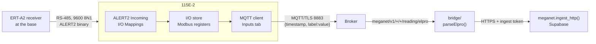

# Provisioning an ELPRO 115E-2 to publish into MegaNet over MQTT

This page covers one job: taking an ELPRO 115E-2 Ethernet I/O and Gateway from its
box to the point where a reading it publishes appears in `meganet.reading`.

It is written in two halves that are done by two different people, and the halves
are kept apart deliberately:

| Part | Who | Where | Roughly |
|---|---|---|---|
| **[Part A](#part-a--system-administrator)** | **System administrator** — you | Broker console, Supabase SQL editor, GitHub, a spreadsheet | Once for the network, then a few minutes per station |
| **[Part B](#part-b--field--bench-technician)** | **Field / bench technician** | At a bench, with the unit, a USB cable and a Windows laptop | ~1 hour per unit, first time longer |

Part A produces a **credentials sheet**; Part B consumes it and produces a
**returned record**. Neither half can finish without the other, and neither needs
to understand the other's tools — that is the point of splitting them.

> ### Running the trial with a technician you cannot stand next to?
> **[`elpro115e_test_card.md`](elpro115e_test_card.md) is the page to send them**, and
> **[`elpro115e_blanks_sheet.md`](elpro115e_blanks_sheet.md) is the one you fill in first** —
> every value the card asks for, with where to find it, and the three rows that are the
> other office's to supply rather than yours.
> It is one sitting, assumes no MegaNet knowledge, and gets a real reading into
> the database against the `elpro_test` station — which exists in the registry for
> exactly this (`db/migrations/0021_elpro_test_station.sql`, publisher `elpro_test`,
> addresses `9001`–`9003`). This page stays the reference behind it: it says *why*
> each setting is what it is, and it is what you read when the card's last section
> comes back with an answer that surprises you.

**Related pages.** [`ingest-mqtt.md`](ingest-mqtt.md) is the design — the topic
scheme and why it is shaped the way it is. [`mqtt-provisioning.md`](mqtt-provisioning.md)
is how the broker and bridge get stood up, which is a prerequisite for this page and
is not repeated here. [`bridge/README.md`](../bridge/README.md) is the subscriber's
own manual.

**Two ELPRO source documents, cited differently.**

| Cite | Document | Covers |
|---|---|---|
| `(p.40)` | [`archive/EL-115E-2_User-Manual_April26.pdf`](../archive/EL-115E-2_User-Manual_April26.pdf), 76 pages | The **115E-2 hardware** — connecting, networking, users, registers, ALERT2 gateway, diagnostics. Its MQTT chapter is two pages and defers everything to the second document. |
| `(MQTT p.4)` | [`archive/ELPRO_x15U_MQTT-SpB-Gateway_Config_v1.0.pdf`](../archive/ELPRO_x15U_MQTT-SpB-Gateway_Config_v1.0.pdf), 24 pages, Nov 2021 | The **MQTT gateway itself** — topic assembly, payload format, every broker and input field, queuing, TLS, diagnostics. |

Both cites are **PDF page numbers**. Do not use the 115E-2 manual's own table of contents
or cross-references: they run as much as 12 pages out from the printed page numbers, and
one reads "see 'Feature license keys' on page 4461". MegaNet facts are cited to `file:line`.

> **Read the hardware caveat before you rely on the second document.** It is written for
> the **x15U** family — 215U-2-BGN, 415U-E-Cx, 415U-2-Cx and 915U-2 (MQTT p.1) — and does
> **not** name the 115E-2. What makes it usable here is that the 115E-2 manual describes
> the same feature set in the same words: MQTT Enable, Enable Sparkplug, Node Update and
> Topic Prefix as the four basic items; Device, Broker, Inputs, Outputs and Security as the
> configuration areas; up to four brokers; and CA Certificate, Client Certificate and Client
> Private Key as the three TLS files (p.40–41). That is the same gateway, exposed through a
> slightly different menu layout. **Treat everything below as ELPRO's documented design and
> confirm it against the actual 115E-2 on the bench** — which is one afternoon, not a
> research project, now that you know what to look for.

---

## Read this before you buy anything

**The 115E-2 can be made to publish something MegaNet stores, and it needs one small,
idiomatic change to the bridge to do it.** That is a change of verdict from the first
version of this page, and it comes from ELPRO's MQTT Gateway Configuration Guide, which
answers the questions the hardware manual left open.

Three facts decide it:

**1 · The Topic Prefix is genuinely free-form.** "The MQTT Topic Prefix can take any form
using / symbol for logical system separations" (MQTT p.6). The full published topic is
simply the prefix plus the **Device** name: "The Device is added to the topic prefix at top
of table to form the overall topic to this payload" (MQTT p.10). So the device can be made
to publish any topic you can spell — including MegaNet's.

**2 · Plain MQTT is JSON, not protobuf.** With Sparkplug *off*, the gateway publishes
(MQTT p.4):

```
Topic:   ELPRO/FLOOD/GATEWAY/Georges Crossing/Register
Payload: {"timestamp":954711743792, "River Level":17.61, "Battery Voltage":13.8356}
```

Documented structure: `{"timestamp":[linux EPOCH time ms], "DataValueLabel":value}`, and
"for each payload there can be multiple time stamped DataValueLabel/value sets with a
single message transmission" (MQTT p.4). **`timestamp` is epoch milliseconds, which
`meganet.ingest()` already accepts as a `reading_ts`.**

**3 · The value label is free text you choose per input.** "Payload Prefix: Enter here the
name of the input that is to be used in the MQTT message… Do not use # or + as they are
illegal characters" (MQTT p.11, p.19).

So the gap between ELPRO and MegaNet is no longer a wall. It is a key-name difference:
ELPRO says `{"timestamp": …, "<label>": value}`, MegaNet wants
`{"alert_id": …, "reading_ts": …, "value_raw": …}`. That is a parser, not a redesign.

### Sparkplug is still a hard no

Leave **Enable Sparkplug** off. With it on, the topic is forced to
`spBv1.0/GROUP/STATE/NODE` (MQTT p.6) — outside `meganet/v1/#`, so the broker never
forwards it and the station ACL refuses the publish — and "the payload is encoded as part
of the Sparkplug standard" (MQTT p.4), i.e. protobuf, which `JSON.parse()` rejects every
time. Both blocks from the previous version of this page stand, for Sparkplug only.

### The recommended path: one format segment, one parser

This is the design's own extension point, already used once for HFEM
(`READING_FORMATS = ['json', 'hfem']`, [`bridge/src/topics.js:66-70`](../bridge/src/topics.js)).
Adding a third costs a subscription line and a parser:

| On the 115E-2 | Value |
|---|---|
| **Topic Prefix** | `meganet/v1/<station>/logger/reading/` |
| **Device** name | `elpro` |
| Resulting topic | **`meganet/v1/<station>/logger/reading/elpro`** |
| **Payload Prefix** per input | the reading's **ALERT2 address**, e.g. `6128` |

| In `bridge/` | Status |
|---|---|
| `src/topics.js` | **done** — `'elpro'` is in `READING_FORMATS`, and `meganet/v1/+/+/reading/elpro` is subscribed at QoS 1 |
| `src/messages.js` | **done** — `parseElpro()` takes `timestamp` as `reading_ts` and turns every address-keyed pair into `{alert_id, reading_ts, value_raw}`. **A payload it cannot read is captured, not discarded**: zero readings, raw bytes in `frame`, which reaches `meganet.reading_raw` because `ingest_http()` writes the raw row before it validates any reading |

Why the address goes in the Payload Prefix rather than a lookup table: **the label
auto-increments**. "If an input count of greater than 1 is used, then a count number will
be appended to the payload name. For a payload name that contains a number as the last
digit, then this input count will increment from this number" (MQTT p.11). A Payload Prefix
of `6128` with an Input Count of 3 publishes `6128`, `6129`, `6130` against three
consecutive registers — which is exactly how a block of consecutive ALERT2 addresses maps
to a block of consecutive registers. One configuration line covers a whole sensor block,
and no mapping table exists for anyone to keep in step.

> **Check this one on the bench before committing to it.** The manual states the
> increment rule for the payload *name*; confirm on real hardware that a purely numeric
> prefix increments the way a trailing-digit name does, and that the emitted key is the
> bare number rather than something decorated. If it decorates, the parser strips it —
> still a parser, still cheap.

### The paths, and what each now costs

| | Path | Verdict |
|---|---|---|
| **A** | **Emit MegaNet's contract exactly, with no bridge change.** | **Not possible.** The topic can be spelled exactly, but the payload cannot: the gateway always emits `timestamp` plus label/value pairs, with no template for key names. Ruled out by MQTT p.4. |
| **B** | **A format segment plus a parser** (above). | **Recommended.** Idiomatic, ~1 subscription + 1 parser, keeps every per-station ACL and the one-contract property intact. |
| **C** | **A translation service** republishing into the scheme. | Now unnecessary. Costs a second always-on process, a credential that can write as other stations, and it breaks the Last Will. Keep only if the bridge must not change at all. |
| **D** | **Sparkplug B decoding.** | Still net-new engineering, and now clearly avoidable — plain mode gives JSON. Revisit only if a Sparkplug fleet arrives. |
| **E** | **Skip MQTT, poll Modbus TCP.** | Still viable and still carries no device-side unknowns, but it forfeits store-and-forward, which is the best thing the ELPRO gateway offers (below). |
| **F** | **Do the status half separately.** | **Still needed, and still open** — see the Last Will gap below. The reading path and the liveness path remain independent. |

### What ELPRO gives you that MegaNet's own loggers do not

**Store-and-forward, up to 10,000 messages.** "Queuing or Historian store-and-forward is a
mode that allows the remote node to be able to hold messages when there is a break in
communications and then transmit these once communications is reestablished. This will
allow the historical data to be 'back filled' to prevent the loss of data" (MQTT p.13).
FIFO or LIFO; a **Queue Delay** rate-limits the flood on reconnect; the queue is shared
across all configured brokers; and messages for a common topic are concentrated into a
single message on the way out (MQTT p.14).

This covers the outage case from the device side, which is worth more here than the QoS
argument: a 115E-2 that loses the broker for an hour backfills, and MegaNet's primary key
eats any duplicates the backfill creates. **The queue is held in RAM and is lost on power
failure** (MQTT p.14) — so it protects against a comms outage, not a flat battery.

### The two things that are still genuinely missing

1. **No Last Will you can configure.** The broker table's columns are Enabled, Client ID,
   IP/Name, Port, Historian, Keep Alive, Clean Session, User name, Password, Queue Size,
   Queue Delay and TLS (MQTT p.8) — **there is no will topic, will payload, will QoS or
   will retain field**, even though the Keep Alive description refers to "the configured
   last will and testament". For Sparkplug that will is NDEATH, defined by the standard;
   for plain MQTT the document never says what, if anything, is sent. So MegaNet's
   `{"online": false}` on `meganet/v1/<station>/status` **cannot be produced by
   configuration**, and station-offline detection has to come from
   `station_health.minutes_since_seen` — which the view already exposes and deliberately
   leaves you to threshold per station.
2. **No QoS or retain control on publishes.** Neither table has a QoS or retain column; only
   the *output* (subscribe) table has a QoS field, "usually set to 1" (MQTT p.13). The
   publish QoS is not stated anywhere and must be observed on the wire. If it turns out to
   be QoS 0, at-least-once is not in force between device and broker — but store-and-forward
   covers the outage case that matters, so this is a thing to measure, not a blocker.


---

## What you are actually building

A 115E-2 in a MegaNet context is a **base station**, not a sensor. It has its own I/O,
but the data worth publishing arrives from the field over ALERT2 and lands in its
register store first:



Three joins have to be right, and they are owned by different people:

1. **ALERT2 → register.** The technician maps each ALERT2 station address and sensor
   ID to a Modbus register (p.51). Sysadmin decides the map; technician types it.
2. **Register → published value.** An Input Configuration row names the register, the
   **Payload Prefix** that becomes the JSON key, and what triggers a publish
   (MQTT p.10–12).
3. **Published value → MegaNet address.** Every reading MegaNet stores needs an
   `alert_id` (1–65535) or a `station_number` + `channel`. **Put the ALERT2 address in
   the Payload Prefix** and the key on the wire *is* the address — which is why the
   register→reading map on the handover sheet has a Payload Prefix column, and why no
   mapping table needs maintaining anywhere.

> **Note what does *not* need solving.** A base station may publish readings for many
> field stations under its own topic. The reading carries its own address
> (`alert_id`), and MegaNet stores against that, not against the topic segment
> (`topics.js:41-45`). The topic segment only decides *who published* and which ACL
> applies. So one 115E-2, one credential, one topic prefix — and hundreds of field
> stations' readings inside it.

---

## The contract the device has to hit

This is the target. Print it and put it on the bench.

**A reading**

```
topic:   meganet/v1/<station>/<device>/reading
qos:     1
retain:  false
payload: {"alert_id": 6128, "reading_ts": "2026-08-19T04:15:00Z", "value_raw": 301}
```

The payload may also be an array of those objects, or `{"readings": [ … ], …}` with
shared defaults. Limits: **1,000 readings** and **256 KiB** per message
(`messages.js:35-39`).

| Field | Required | Notes |
|---|---|---|
| `alert_id` | one of these two | The ALERT/ALERT2 address, **1–65535**. This is the natural fit for a 115E-2 relaying ALERT2. |
| `station_number` + `channel` | one of these two | For a station with no ALERT address. `channel` is e.g. `"rain"`, `"level"`. |
| `reading_ts` | yes | ISO 8601 (`"2026-08-19T04:15:00Z"`) or epoch seconds/ms. Rejected if before 1990 (a dead clock) or more than a day in the future. |
| `value_raw` | yes | The value as measured. A reading carrying only `value` is accepted; one with neither is rejected. |
| `value`, `unit`, `quality` | no | `unit` comes from a fixed list (`mm`, `m`, `V`, `degC`, `NTU`, …) — an unrecognised one is a rejected row, not a guess. |

**Status and Last Will** — what MegaNet wants, and what a 115E-2 cannot currently give it:

| | Value |
|---|---|
| Topic | `meganet/v1/<station>/status` |
| QoS | `1` |
| Retain | **on** |
| Live payload | `{"online": true, "battery_v": 12.9}` — or just the text `online` |
| Will payload | `{"online": false}` — or just the text `offline` |

> **The ELPRO gateway has no configurable Last Will.** The broker table's twelve columns
> carry no will topic, payload, QoS or retain (MQTT p.8), and no retain control exists for
> ordinary publishes either. So this table describes the target, not a setting you can
> enter, and **offline detection for a 115E-2 comes from staleness** —
> `station_health.minutes_since_seen` against that station's Update Time — until the bench
> test in [D4](#d4--find-out-what-the-last-will-actually-does) proves otherwise.
>
> The reading path does not depend on any of this. The two halves fail independently,
> which is why they are tested independently.

**`<station>`** is the **bureau station number** for a gauging station. A base station
is an ingest point, never has a bureau number and never will, so it publishes under its
`stations.json` **station id** — the precedent in this repo is `18_bateson`. Either
resolves without a mapping table (`meganet.resolve_publisher()`, `0020`). Segments must
match `^[A-Za-z0-9][A-Za-z0-9._-]{0,63}$` — letters, digits, dot, dash, underscore, no
spaces.

**`<device>`** is which box at the site is talking: `logger` for the usual single box.
**It is not optional** — the reading topic is five segments, always.

---

## Part A — System administrator

Items 1–3 are a gate. Do not order hardware or brief a technician past them.

### A0 · The gate

1. **Confirm the gateway behaves on 115E-2 hardware as the x15U guide documents.**
   ~~Obtain the separate MQTT manual~~ — done, it is
   [`archive/ELPRO_x15U_MQTT-SpB-Gateway_Config_v1.0.pdf`](../archive/ELPRO_x15U_MQTT-SpB-Gateway_Config_v1.0.pdf).
   What remains is a bench session against one real 115E-2, answering five questions:

   | Question | Why it matters |
   |---|---|
   | Does the MQTT I/O page carry the same **Input Configuration** columns (Device, IO-Type, Local Input, Payload Prefix, Register, Input Count, Sensitivity, Update Time, Scaling, Offset)? | The whole register→reading map assumes them (MQTT p.10). |
   | Does the **Topic Prefix** accept `meganet/v1/<station>/logger/reading/` verbatim, and does the Device name land as the final segment? | The recommended path depends on it (MQTT p.6, p.10). |
   | What **QoS and retain** does it actually publish with? | Not configurable and never stated (MQTT p.8). Observe it on the wire. |
   | Does a purely numeric **Payload Prefix** auto-increment, and is the emitted key the bare number? | Decides whether the parser needs to strip decoration (MQTT p.11). |
   | Is there **any** Last Will behaviour in plain MQTT mode? | Decides whether offline detection is config or staleness (MQTT p.8). |

   Capture the topic string and payload bytes against a plaintext broker on 1883 while you
   are there — that is the artefact everything else is written against.

2. **Resolve the Feature Key question in writing.** Page 5 reads: "The 115E-2 comes from
   the factory with ELPRO WIB, Modbus TCP/RTU, DNP3 (requires Feature Key), MQTT and
   Alert protocol (requires Feature Key) support as standard." That sentence can be read
   two ways. The weight of evidence says **MQTT is not licensed** — the MQTT chapter
   never mentions a key, while DNP3 (p.35) and ALERT2 (p.49) both do, and the
   specification table lists "MQTT +Sparkplug" unqualified (p.59). But confirm it with
   ELPRO or by reading the **Feature Keys** page on a real unit. If it *is* licensed,
   keys are bound to the module serial number and become a procurement lead time, not a
   configuration step.

   **The ALERT2 gateway is definitely licensed** (p.49) and needs firmware ≥ 2.33.
   If you are relaying ALERT2, budget for it.

3. ~~**Confirm the path and schedule the bridge change.**~~ — **done.** Path B shipped:
   `READING_FORMATS` carries `elpro`, the bridge subscribes to
   `meganet/v1/+/+/reading/elpro`, and `parseElpro()` sits beside `parseHfem()` with unit
   and integration tests. **It is deliberately permissive** — a payload it cannot read
   returns zero readings and puts the raw bytes in the envelope's `frame`, so an
   undocumented shape lands in `meganet.reading_raw` instead of an ephemeral container log.
   That is what makes a remote test safe to run before anyone has seen this hardware.

### A1 · Fleet standards

4. **Fix a firmware version.** MQTT floor is **V2.33** (p.5); the manual in `archive/`
   documents **2.55 or later** with CConfig **2.1.0.72** (p.2). Firmware comes only from
   ELPRO technical support (p.67) — no public URL, no published checksum. Compute your
   own checksum, record it, and keep firmware plus configuration in the offsite backup
   the hardening appendix asks for (p.66).

5. **Register the base station in MegaNet and fix its publisher segment.** Confirm the
   exact string the database will resolve, before it is flashed into anything:

   ```sql
   select coalesce(nullif(station_number, ''), id) as publisher
     from meganet.station
    where enabled and deleted_at is null
      and id = '<your_base_station_id>';
   ```

   Get this wrong and readings still land — they carry their own addresses — while
   `meganet.station_health` quietly accrues a row keyed by a string that names nobody.

6. **Decide the `<device>` segment** for each box at the site. `logger` unless there is
   more than one.

### A2 · Broker and bridge

The full run is [`mqtt-provisioning.md`](mqtt-provisioning.md). What matters here:

7. **Confirm the broker.** TLS on **8883**, TLS 1.2 floor, `allow_anonymous false`,
   persistent sessions kept. On HiveMQ Cloud note 8883 (TLS, for devices) versus 8884
   (WSS, for the browser Web Client only — a 115E-2 cannot use it).

8. **Mint the station credential.** `station-<publisher>`, **publish/write** on
   `meganet/v1/<publisher>/#`, and nothing else. `write`, not `readwrite` — a logger has
   nothing to read here. Generate these from the database rather than typing them once
   there are more than a handful; the query is in
   [`bridge/deploy/mosquitto.acl.example:29-35`](../bridge/deploy/mosquitto.acl.example).

   > **Generating from the same column the database resolves against is what makes a
   > mistyped segment loud.** A credential may only write the topic its own number
   > spells, so a unit configured with `041564` instead of `41564` is refused by the
   > broker rather than filed under an identity nobody claims.

9. **Confirm the bridge credential** (`meganet-bridge`, **subscribe** on `meganet/v1/#`,
   writes nothing) and that the bridge is running with `MQTT_CLIENT_ID` pinned.

10. **Mint the MegaNet ingest token** if one does not exist, in the Supabase SQL editor:

    ```sql
    select meganet.create_ingest_token('mqtt bridge');
    ```

    Shown once, starts `mgn_`, only its hash is stored. To rotate:

    ```sql
    update meganet.ingest_token set revoked_at = now() where label = 'mqtt bridge';
    select meganet.create_ingest_token('mqtt bridge');
    ```

    **This token never goes on the technician's sheet.** It belongs to the bridge, not
    to the station. The station gets a broker username and password and nothing else.

### A3 · The two decisions the manual will not make for you

11. **The TLS posture — and state it unambiguously on the sheet.** Both ELPRO documents
    say the same thing and neither resolves the ambiguity. The 115E-2 manual says brokers
    "will normally require **either** TLS **or** Username/Password" (p.41), then requires
    three files for each TLS broker. The MQTT guide repeats it: "To use TLS with the MQTT
    gateway broker/server connection there are 3 certifications required: Certificate
    Authority (CA), Client Certificate (using CA above), Client Private Key" — and adds the
    one genuinely new fact, that **they must be x.509 files** uploaded through the MQTT
    Security page (MQTT p.14). **Server-only TLS is still never confirmed as supported.**

    Decide which you are provisioning:
    - **(a) Server-only TLS + username/password** — one CA bundle for the fleet. Cheap, and
      the first thing the technician should try, because it is the difference between a
      shared password and a PKI programme.
    - **(b) Mutual TLS** — a certificate and private key per device, with issuance, expiry
      monitoring and rotation for units that will outlive their certificates.

    **Name the CA bundle the device must trust**, in a file, on the sheet. Nothing in
    this repo specifies this for a third-party device — `MQTT_CA_FILE` covers only the
    bridge's own trust store. The technician's returned record settles which posture the
    hardware actually accepts.

    > **Port 8883 is fine.** The broker table has a **Port** column, "Default is 1883"
    > (MQTT p.8), and the documented example rows use 1884 as well as 1883 — so the port is
    > free text, not a fixed pair. That closes an open question from the first version of
    > this page.

12. **Build the register → reading map.** One row per published point. This is the join
    nothing else supplies:

    | ELPRO register | ALERT2 addr / sensor ID | Name | Type | Unit | MegaNet address |
    |---|---|---|---|---|---|
    | `46009` | `1234` / `1` | Loudoun Br river level | S-4 | `m` | `alert_id: 6128` |

    Recommended ELPRO register ranges for ERT-A2 work (p.51):

    | Value type | Range |
    |---|---|
    | Signed/unsigned 16-bit (S-2, U-2) | `40401`–`46000` |
    | Signed/unsigned 32-bit (S-4, U-4) | `46009`–`47999` |
    | Floating point (F-4) | `48005`–`49999` |

    **32-bit values occupy two 16-bit registers and may only be read on odd addresses.**
    A float at `46009` is followed by `46011`, then `46013`. Reading `46012` returns a
    Modbus address error (p.51).

    > **One known contradiction to settle on hardware:** the floating-point supply
    > voltages are given as 38005–38008 in the body (p.8), 38005–38012 "in volts" at
    > p.25, and 38009–38016 in the
    > appendix table (p.62). Do not publish either until IO Diagnostics confirms which
    > is live on your firmware.

### A4 · Network and policy

13. **Firewall.** Outbound **TCP 8883** from the base station to the broker. **Also open
    UDP 123 (NTP)** — NTP is *missing from the manual's port table* (p.66) even though
    the device has Enable NTP and NTP Server IP fields (p.48), and its real-time clock
    holds time for only "at least twelve hours (typical 3-5 days)" without power. A
    firewall built strictly from that table blocks NTP and silently breaks certificate
    validation after an outage. Keep **TCP 80** (configuration and dashboard, cleartext)
    off any untrusted path.

14. **Credentials policy.** New Admin and Manager passwords, minimum eight characters
    (p.44), per-person rather than shared, distributed out of band. Note that accounts
    **cannot be deleted — only "retired"** — and no rename function is documented (p.43–44),
    so `admin` and `user`
    remain as usernames whatever you do.

15. **Publish cadence and volume.** No MegaNet-side budget exists yet. HiveMQ's free tier
    is 100 connections / 10 GB a month / 5 MB messages, and `meganet.retain()` is still
    run by hand — the whole network at 15-minute reporting is roughly 914,000 rows a
    day, which fills the Supabase free tier in under a week. Pick a cadence deliberately.

16. **Asset inventory and network filtering rules.** Record manufacturer, type, serial,
    firmware and location (p.65). Prepare the IP whitelist rules to hand over —
    "Network Filtering" page, disable "Easy IP Filtering", add explicit rules (p.66).

17. **Issue the sheet** ([Part C](#part-c--the-handover-sheet)) and tell the technician
    which path from the gate is in force.

---

## Part B — Field / bench technician

You are at a bench with a 115E-2, a USB cable, a Windows laptop and a sheet from the
sysadmin. Work in this order. **Anything the sheet leaves blank, ring and ask — do not
guess.** Several steps ask you to *record* something; those answers fill gaps the ELPRO
manual leaves open, and they are as much the deliverable as the working unit.

### B1 · Before power

1. **Kit check.**
   - USB **A-to-B** cable — the module's port is USB-B, on the bottom of the unit (p.14–15).
   - **CConfig** installed (elprotech.com → Resource page → 115E-2 → Software), version
     per the sheet, ≥ 2.1.0.72 (p.2). "Standard Installation" replaces any existing
     CConfig; "Parallel Installation" keeps the old one alongside (p.14).
   - The **USB driver**, `Inst_Elpro_USB_Driver_2.0.0.2.exe_zip`, if you intend to use
     the web pages (p.42). Installing CConfig normally installs the drivers too (p.15).
   - The certificate files, the sheet, and somewhere to write.

2. **Read the side label and write it down now, before the unit is racked:**
   - the **serial number** (needed for any future feature key, and for a factory reset),
   - the **default IP** `192.168.0.1XX`, where `XX` is the last two digits of the serial (p.35, p.57),
   - the **individual password**, if this unit's label carries one (p.15).

   If the label becomes unreadable later, the serial number can still be read from the
   home page (p.48) or Modbus registers `30494`–`30496` (p.53), and the default IP follows
   from it — but only by someone who can already log in. **The individual label password
   has no documented recovery path at all.**

### B2 · Power and first connection

3. **Power on and wait for PWR solid green** — about 80 seconds. The sequence is red
   ~2 s → orange 12 s → fast red/green flash 30 s → slow flash 50 s → solid green
   (p.57). A factory-new unit should reach solid green.

4. **Connect over USB. It has to be USB the first time** — "On first connection, you must
   connect to the device through its USB port" (p.14, p.42), restated in troubleshooting
   as "When the unit is new from the factory, you can only configure the unit using the
   USB port" (p.57). Ethernet configuration access is off until someone turns it on, and
   **turning it on can only be done over USB** (p.15).

   Windows should recognise a device identifying as **"115E-2"** and add a network
   adapter called **"Elpro 115E-2 USB Ethernet/ RNDIS Interface"** (p.15).

   > If that adapter does not configure itself an address, stop and record it. The manual
   > gives no netmask for the USB link and no PC-side address to enter manually.

5. **Get in.**
   - **Web:** browser → `http://192.168.111.1`. That address is always the same, on every
     unit, and HTTP is always open on the USB port (p.42, p.66).
   - **CConfig:** Communications panel → **Program Unit** → connection dialog → **USB** →
     **Refresh** until USB Status shows "Connected" → username and password → **OK** (p.15–16).

6. **Log in, and record which credential worked.** Try in this order: `user`/`user`, then
   `admin`/`admin` (p.43–44), then the password printed on this unit's label. **The
   manual contradicts itself** — p.15 says the default depends on firmware ("V2.55 and
   earlier: `user`; V2.59 and later: check product label"), while p.16, p.42 and the
   default-users table all state it flatly as `user`. Your answer resolves it for this
   shipment. `admin` is the Admin role; `user` is Manager (p.43–44).

### B3 · Baseline the unit

7. **Read and record the firmware version** from the home page (p.49; also Modbus
   registers 30497–30499, p.53). **Below V2.33 the unit cannot do MQTT at all** (p.5) —
   stop and return it for upgrade.

8. **Upgrade if the sheet says to.** System Tools → **Firmware Upgrade** → browse to the
   patch file → **Send** → on success, **Reset** (p.47). Existing configuration is
   preserved. For a full USB upgrade follow p.67–69 exactly, and **do not interrupt
   power** — an interrupted upgrade means the unit goes back to ELPRO.

9. **Open Feature Keys and record exactly what the page lists**, in particular whether
   MQTT appears there at all. If the sheet includes a key: check the serial on the
   certificate matches the module label, enter the key, **Save Changes**, confirm a green
   checkmark (a red cross means invalid), then **Save Changes and Reset** (p.48–49).
   Feature keys survive a factory-default reset.

   > **Demonstration mode** enables all licensed features for 16 hours or until restart
   > (p.49). Useful for a bench test; never for commissioning.

### B4 · Harden and identify

10. **Change the default passwords now**, before anything else goes on the unit.
    **Change Password** for your own account, and **User Management → Password → Change**
    for the other default account. Minimum eight characters (p.44). The manual is blunt:
    "The 115E-2 should not be commissioned for production with Default credentials"
    (p.65). Finish with **Save and Activate Changes**.

11. **Module Information** (p.47): set **Device Name** to the exact string on the sheet —
    it must be unique across the fleet, because data-log directories are named after it
    (p.56). Fill in Owner, Contact, Description and Location from the sheet.

12. **Network settings** (p.43): enter **IP Address**, **Subnet Mask** and **Default
    Gateway** exactly as on the sheet. Static only — no DHCP option is documented
    anywhere.

13. **Date and Time** (p.48): tick **Enable NTP** and enter the **NTP Server IP** from the
    sheet, then **Save changes and activate**; the message beside the field updates to
    show whether it connected. If NTP is not available, set the clock manually **in UTC**
    — the device has no time-zone or daylight-saving support, and its clock is what your
    timestamps and TLS certificate validation both depend on.

14. **Remote access**, only if the sheet asks for it: in CConfig, on the device's main
    configuration page, tick **Remote access** — "Check this to enable remote
    configuration access to the device from the radio or Ethernet ports" (p.16).
    **This can only be done over USB** (p.15). Bear in mind that configuration traffic is
    plain HTTP on port 80 — there is no HTTPS option — so anything you type over Ethernet
    afterwards travels in the clear (p.65, p.66).

    Then apply the **IP whitelist** from the sheet, if it carries one: the **Network
    Filtering** page, **disable "Easy IP Filtering"**, and add an explicit rule per allowed
    remote device (p.66). **No chapter of the manual documents this screen** — only the
    hardening appendix names it — so record the menu path you found it under and the rule
    syntax it actually wanted.

### B5 · The ALERT2 gateway, if this unit is relaying ALERT2

Skip to [B6](#b6--mqtt) if the sheet does not mention ALERT2. This is web-page
configuration only — "Setup for the Alert protocols can only be done through Web page
configuration" (p.49) — and needs the ALERT2 feature key and firmware ≥ 2.33.

15. **Set up the incoming serial stream** (p.51). Choose **ERRTS IO Gateway** as the
    **RS-232** or **RS-485 Port Type**, then match the serial settings to the source:
    - ERT-A2 Receiver Base → **RS-485**, 9600, 8N1, no flow control
    - ELPRO ERRTS decoder chain → **RS-232**, 9600, 8N1, no flow control

    Then set **ALERT Protocol Mode** to **"ALERT2 In"** for ALERT2 binary, or
    **"ALERT In"** for legacy ALERT.

16. **ALERT2 Incoming I/O Mappings** — this is what puts field data into registers where
    MQTT can reach it. Click **Add Entry** for each line on the sheet's register map (p.51):
    1. Enter the **ALERT2 station address** in the source Address field.
    2. Fill the **four sensor ID columns**. Use **255** for any unused slot; if a station
       has more than four sensors, add a second line.
    3. Enter the **starting Modbus register**, using the correct range for the value type
       (32-bit for rain and river values, 32-bit float for SDI-12 variables).
    4. Apply **scale** and **offset** if the sheet specifies them — they apply to the
       whole line.

17. **Record any line you could not enter as written**, and why.

### B6 · MQTT

MQTT is documented only under **CConfig** — "Access the MQTT Configuration by selecting
MQTT on the tree view under the device" (p.40). The manual never says whether the web
pages can do it, in either direction, and the web role-privileges table has no MQTT row
(p.44). **Record which of the two you were actually able to use.**

18. **In CConfig**, add the unit if it is not already in the project (Units → **Add a new
    Unit**), configure it as a **base station**, then select **MQTT** on the tree view.

19. **Basic Configuration Items** (p.40; MQTT p.6):

    | Field | Set to | Note |
    |---|---|---|
    | **MQTT Enable** | on | MQTT, like every protocol on this device, is **disabled by default** (p.66). |
    | **Enable Sparkplug** | **off** | Not optional. With Sparkplug on the topic is forced to `spBv1.0/GROUP/STATE/NODE` and the payload becomes protobuf — MegaNet can store neither (MQTT p.4, p.6). |
    | **Owner Name (Group)** / **Device Name (Node)** | from the sheet | Pulled from Module Information; editable here (MQTT p.6). With Sparkplug off these do not appear in the topic, but they are reported in the node's own status messages. |
    | **Topic Prefix** | `meganet/v1/<station>/logger/reading/` — exactly, from the sheet | Free-form, `/` allowed anywhere (MQTT p.6). The **Device** name from step 22 becomes the final segment, giving the full topic. |
    | **Queuing Mode** | **FIFO** unless the sheet says otherwise | FIFO replays an outage in the order it happened, which is what you want for a backfill (MQTT p.7). |
    | **Node Update** | the value on the sheet, in **seconds** (the documented example is 600) | The regular status/statistics update interval (MQTT p.6). |

20. **Broker configuration table** (p.41; MQTT p.8). Up to four brokers; you need one. The
    documented columns, in order, and what to put in them:

    | Column | Value |
    |---|---|
    | **Enabled** | ticked |
    | **Client ID** | the unique value on the sheet — "This MUST be unique in this broker" |
    | **IP/Name** | the broker hostname (DNS name is fine — see the DNS note below) |
    | **Port** | **8883** |
    | **Historian** | **ticked** — flags messages that were queued during an outage |
    | **Keep Alive(Sec)** | the sheet's value; 20–60 s is the documented range for Ethernet |
    | **Clean Session** | **unticked** — "Leave off to preserve data for a persistent data configuration" |
    | **User name** / **Password** | `station-<publisher>` and its password |
    | **Queue Size (Max)** | the sheet's value; the maximum is 10,000 shared across all brokers |
    | **Queue Delay (s)** | **0** for an Ethernet link |
    | **TLS** | ticked, with the certificates loaded first (step 21) |

    > **There is no QoS, retain or Last Will column** — publishes are not configurable in
    > those respects (MQTT p.8). Do not go looking for them; **do** record it if this
    > 115E-2's page has them and the x15U guide's does not.
    >
    > If the broker is reached by hostname, the unit needs DNS: **Network** page →
    > Advanced Networking → Default Gateway, Primary DNS, Secondary DNS, then **Save
    > Changes and Reset** (MQTT p.15).

21. **Security tab** (p.41): add the **CA Certificate file** from the sheet. If the sheet
    specifies **mutual TLS**, also add the **Client Certificate file** and the **Client
    Private Key file**; if it specifies **server-only TLS**, try the CA certificate alone
    with the broker username and password, and see whether the device accepts it. The
    manual demands all three for every TLS broker but also says brokers need "either TLS
    or Username/Password" — which of those is true on real hardware is the answer the
    sysadmin needs back.

    > **Record whether server-only TLS was accepted** — CA certificate alone plus
    > username and password — or whether the client certificate and key were genuinely
    > mandatory. Also record which **file formats** were accepted and rejected, and
    > whether the tab holds one file set for the whole device or one per broker. The
    > manual states none of this, and the answer decides whether the fleet needs a PKI.

22. **Device configuration** (p.40–41; MQTT p.7–8): add the logical device(s) named on the
    sheet. **The Device name becomes the final topic segment**, so for the recommended
    setup this is the single entry `elpro`, with **Device Type** = *General Purpose* (which
    gives the `Register` IO-Type). Slave address 0 — only 115S expansion units need one.

23. **Input Configuration** (p.41; MQTT p.10–12) — one row per line on the sheet's register
    map. The documented columns:

    | Column | Value |
    |---|---|
    | **Enabled** | ticked |
    | **Device** | `elpro` |
    | **IO-Type** | `Register` |
    | **Local Input** | `Register` |
    | **Payload Prefix** | the reading's **ALERT2 address**, e.g. `6128`. No `#` or `+`. |
    | **Register** | the ELPRO register holding that value |
    | **Input Count** | how many consecutive registers this row covers — the Payload Prefix increments with them |
    | **Sensitivity** | change threshold before a publish; **0 means never publish on change** |
    | **Update Time (sec)** | regular publish interval; **0 means never publish on a timer** |
    | **Scaling** / **Offset** | from the sheet; `1.0` and `0` leave the value untouched |

    > **Set at least one of Sensitivity and Update Time to a non-zero value**, or the row
    > never publishes at all (MQTT p.11–12). Selecting a row displays the full topic below
    > the table — **read it back and check it against the sheet before saving.**
    >
    > **Save often.** "There is an activity timeout on configuration menus" (MQTT p.10).
    >
    > For more than a handful of rows use **Export Table / Import Table** — the CSV
    > round-trip below the table (MQTT p.18–19, and step 32).

24. **Outputs tab** (p.41): leave it alone unless the sheet says otherwise. MegaNet's
    bridge publishes nothing and sends no commands, so there is nothing to subscribe to.

25. **Commit** — **Program Unit** in CConfig (p.16), or **Save and Activate Changes** on
    the web pages (p.44). **Record whether the unit rebooted, how long it was offline,
    and whether you lost your session.** The manual does not say.

### B7 · Verify on the bench, before it leaves

26. **LEDs** (p.57–58): **PWR solid green** (system OK), **LAN green** (connected), and at
    the Ethernet socket **100M green** (100 Mbps link) and **LINK orange** (activity).
    **There is no MQTT LED** — the front panel cannot tell you the broker is connected.

27. **Ping the unit** from the laptop at its new address (p.57).

28. **Statistics page → TCP/UDP Statistics** — "This section lists all open ports" (p.66).
    Record what is listening; confirm nothing unexpected is.

29. **Monitor MQTT Comms** — the single most useful screen on the unit, and much better
    documented than the 115E-2 manual's one sentence suggests. Network Diagnostics →
    **Monitor MQTT Comms** (p.16; MQTT p.17–18). Pick the broker; monitoring **starts
    automatically** when the page opens, with **Stop** and **Clear** buttons. Each line
    shows:

    > broker name or IP · date/time · **Tx** or **Rx** · **MQTT topic** · **MQTT payload**
    > (Sparkplug is decoded automatically for display)

    **Copy the lines out and paste them into the returned record.** This is where you read
    the real topic and the real payload without a packet capture — it shows MQTT messages
    only, not the connection handshake.

    Cross-check the connection itself two ways: the **Connectivity** page shows broker
    state, uptime, reconnect count, Tx/Rx messages and bytes, queue size and error count
    (MQTT p.16); and registers **30430** (broker 1), **30445**, **30460**, **30475** carry
    the same as numbers — offset 0 is connected yes/no, 1 is link count, 2 is uptime in
    seconds, 8 is **messages currently sitting in the queue** (MQTT p.16, p.20–21).

30. **Capture IP Comms** (p.54): Network Diagnostics → **Capture IP Comms** → **Start**,
    trigger a publish, then **Stop and Download** and open the file in Wireshark. Capture
    stops itself at 20,000 packets.

    > **On 8883 you will see the TLS handshake, not the payload.** That is still the
    > evidence you need if the handshake fails. **To read the actual topic string and
    > payload bytes — the most valuable line on the returned record — do one bench run
    > against a plaintext scratch broker on 1883 first.**

31. **IO Diagnostics** (p.52): enter a **Register** address and a **Count**, click
    **Read**, and compare the values against the register map. Watch for the flags:
    - `~` — the register is in the **Invalid** state. Mappings that include an invalid
      register are not sent at all.
    - `*` — the register is at its **fail-safe** value.

    Record the raw values and any flags. This is what lets the sysadmin check the value on
    the wire against the value in the device.

32. **Export the configuration, twice.** (p.47; MQTT p.16–18)
    - System Tools → **Read Configuration File** → **Entire unit Configuration** →
      **Download** — the unit's full backup. Record the filename and the **Config Version**
      timestamp from Module Information.
    - **Export Table** below the Input Configuration — the register map as CSV. This is the
      seed for every subsequent unit: edit the Payload Prefixes and Registers, then
      **Import Table** on the next one.

    > **Two things must change per unit when you reuse either file: the broker Client ID
    > and the Topic Prefix.** ELPRO is explicit about the first — "ensure that the ClientID
    > used in the broker configuration is changed so that it is unique in the system.
    > Failing to do so will lead to the broker denying the connection" (MQTT p.17) — and
    > the second carries the station segment, so cloning it publishes one station's data
    > under another's name, which the broker ACL will refuse.

33. **Ring the sysadmin and stay on the line** while they run the SQL in
    [Part D](#part-d--proving-it-works). **Do not pack the unit until they confirm a row.**

34. **Complete the returned record** ([Part C](#part-c--the-handover-sheet)) and hand it back.

---

## Part C — The handover sheet

### C1 · Sysadmin → technician

Every field must be a **literal value**, not a description. Anything left blank becomes a
guess at the bench.

**Identity**
- `<station>` publisher segment — exact string. *Type exactly: leading zeros matter;
  letters, digits, dot, dash, underscore only; 64 characters maximum.*
- `<device>` segment — normally `logger`.
- Device Name for Module Information, plus Owner / Contact / Description / Location.

**Topics, written out in full**
- Reading: `meganet/v1/<station>/<device>/reading`
- Status and Last Will: `meganet/v1/<station>/status`, **QoS 1**, **retain on**,
  will payload `{"online": false}`

**Broker** — one value per column of the unit's broker table
- **IP/Name** (hostname) and **Port** `8883`; TLS 1.2 minimum
- **User name** `station-<publisher>` and **Password**
- **Client ID** — **unique network-wide**; ELPRO warns that a duplicate makes the broker
  deny the connection, and two clients sharing one id knock each other off in a loop
- **Clean Session** off; **Keep Alive** value; **Historian** on
- **Queue Size (Max)** and **Queue Delay (s)** — 0 delay on Ethernet
- DNS servers, if the broker is named rather than numbered
- *(QoS and retain are not configurable on this device — do not put them on the sheet as
  instructions; they belong in the returned record as observations.)*

**TLS material**
- CA bundle: filename, how supplied, expected format
- Client certificate and private key, if mutual TLS is in force; whether the key may be
  passphrase-protected
- Expiry dates and who to contact for renewal

**Network**
- IP address, subnet mask, default gateway
- NTP server IP
- Whether Remote access (Ethernet configuration) is to be enabled

**Device MQTT settings**
- **Topic Prefix** — the literal string, ending in `/`:
  `meganet/v1/<station>/logger/reading/`
- **Device** name — `elpro`, type *General Purpose*, slave address 0. This becomes the
  final topic segment, so the full topic is `meganet/v1/<station>/logger/reading/elpro`
- **Enable Sparkplug** — **off**
- **Owner Name (Group)** and **Device Name (Node)**
- **Queuing Mode** — FIFO
- **Node Update** — value in **seconds**

**ALERT2 gateway**, if applicable
- Port (RS-232 / RS-485), baud, data format, ALERT Protocol Mode
- One row per mapping: ALERT2 station address, up to four sensor IDs (255 for unused),
  starting Modbus register, scale, offset

**Register → reading map** — give this as the Input Configuration table the technician
will type or import, one row per block:

| Payload Prefix | Register | Input Count | Sensitivity | Update Time (sec) | Scaling | Offset | (what it is) |
|---|---|---|---|---|---|---|---|
| `6128` | `46009` | 1 | 0.01 | 900 | 1.0 | 0 | Loudoun Br river level, m |

- **Payload Prefix is the ALERT2 address**, and it auto-increments with Input Count — so a
  block of consecutive addresses against consecutive registers is one row.
- At least one of **Sensitivity** and **Update Time** must be non-zero or the row never
  publishes.
- Supply it as a **CSV** for import where there are more than a handful of rows; the column
  order is `Enabled, Device, IO-Type, Local Input, Payload Prefix, Register, Input Count,
  Sensitivity, Update Time (sec), Scaling, Offset`, with Device as its table line number
  minus one, IO-Type `0`, Local Input `0` for General Purpose registers (MQTT p.18–19).

**Credentials and policy**
- New Admin and Manager passwords, or the policy plus a sealed envelope
- CConfig version to install (≥ 2.1.0.72)
- Firmware target, patch or full file, checksum, and which upgrade method
- Feature key value(s) and certificate, with the module serial they are bound to
- Network Filtering / IP whitelist rules

**Escalation**
- Your name, phone, and the window in which you will be watching the broker and running
  the SQL.

### C2 · Technician → sysadmin

**Asset facts**
- Module serial number, firmware version and patch level, CConfig version used
- Configured IP / mask / gateway, Device Name, Config Version timestamp
- Filename and location of the exported configuration
- Commissioning date and technician name

**Answers that close gaps in the ELPRO manual** — this is why the record exists
- Which default password worked
- What the **Feature Keys** page listed, and whether MQTT was on it
- Whether MQTT was reachable **from the web pages**, or only from CConfig
- The **exact field labels on the Broker tab**, and whether a port field exists
- Whether the Broker tab exposed client id / keep-alive / clean session / QoS / retain /
  **Last Will** fields, and their labels
- Whether **server-only TLS was accepted**, or client certificate and key were mandatory
- Certificate **file formats** accepted and rejected; one file set globally or one per broker
- **Node Update**: units shown, range accepted, default it arrived at
- **The actual topic string the device published** — the single most important line here
- **The actual payload bytes** the device published, hex or text
- Whether Program Unit / Save and Activate caused a reboot, and for how long

**Evidence**
- Open ports from Statistics → TCP/UDP Statistics
- MQTT Comms output, verbatim
- IO Diagnostics values for every register on the map, with any `~` or `*` flags
- Any Capture IP Comms file, and whether the TLS handshake completed
- LED state at handover: PWR, LAN, 100M, LINK

**Deviations** — anything on the sheet that could not be done as written, and what was
done instead.

---

## Part D — Proving it works

### D1 · Sysadmin side, before the device exists

Prove the MegaNet half on its own, so that when the device fails you already know it is
not this half.

1. **Broker and ACL.** In the HiveMQ Web Client (port **8884**, `wss://` — a browser
   cannot use 8883), publish as `station-<publisher>` to
   `meganet/v1/<station>/logger/reading`, QoS `1`, retain off:

   ```json
   {"alert_id": 6128, "reading_ts": "2026-08-19T05:30:00Z", "value_raw": 301}
   ```

2. **Negative ACL test — the half nobody runs.** With the same credential, publish to
   `meganet/v1/<some other segment>/logger/reading`. **The broker must refuse it.** If it
   succeeds, the credential is over-scoped; go back to A8.

3. **Did it land?**

   ```sql
   select addr, reading_ts, value_raw, source, dup_count
     from meganet.reading order by received_at desc limit 5;
   ```

   Republish the identical message: **no new row appears, `dup_count` increments
   instead.** That is the primary key (address, instant, value) eating the duplicates
   that QoS 1 guarantees — and it is why this design does not need QoS 2.

4. **Station health.**

   ```sql
   select station_key, station_id, online, since, last_reading_at
     from meganet.station_health where station_key = '<publisher>';
   ```

   A row keyed by a bare string nobody can name means the segment resolves to no station —
   check it against `meganet.station.station_number` and `meganet.station.id`.

5. **Bridge alive, and told apart from a quiet field.**

   ```sql
   select bridge_id, connected, last_message_at, last_insert_at, pending,
          now() - last_seen_at as silent_for
     from meganet.bridge_health;
   ```

   `silent_for` growing past a couple of minutes means the process is gone.
   `last_message_at` old but `last_seen_at` fresh means the bridge is fine and the *field*
   has gone quiet — a different problem, with different people to wake.

### D2 · The joint test — do it once, on the phone

The technician triggers a publish while you watch the broker Web Client subscribed to
`meganet/v1/#`, then run the queries above. There are exactly three outcomes and each has
a different owner:

| What you see | What it means | Whose problem |
|---|---|---|
| **Nothing in the Web Client** | The broker refused it — ACL, credential or topic — or TLS never completed. | Technician's side. Evidence is Capture IP Comms and MQTT Comms. |
| **In the Web Client, but no row in `meganet.reading`** | The topic or payload does not match the contract. Read the bridge log: `topic_ignored` names the topic and why; `message_unparseable` names the payload problem. | This is the gate question, answered on real hardware. The captured topic and payload bytes go straight onto the returned record. |
| **A row appears** | Confirm `addr`, `reading_ts`, `value_raw` and `source` match what IO Diagnostics showed on the device. Then republish identically and confirm `dup_count` rises rather than a second row appearing. | Done. |

**Do not pack the unit until the third outcome has happened at least once.**

### D3 · The four bridge log lines that matter

```
subscribed              the three filters, at connect
subscribe_downgraded    ERROR — the broker granted QoS 0; at-least-once is off. Fix at the broker.
topic_ignored           WARN  — published under meganet/v1/… with the wrong shape. Constant = a topic typo.
message_unparseable     ERROR — the topic matched but the body did not.
```

Those last three are exactly how a misconfigured 115E-2 presents, and they are
distinguishable: broker-side refusal leaves **nothing at all** in the bridge log; a wrong
shape under the right prefix gives `topic_ignored`; the right topic with the wrong payload
gives `message_unparseable`.

**In none of these cases is the device told anything.** MQTT gives a publisher no reply
channel — the PUBACK it receives is from the *broker*, and means the broker has the
message, not that MegaNet does.

### D4 · Find out what the Last Will actually does

On a MegaNet logger this step confirms offline detection works. **On a 115E-2 it is an
experiment**, because the broker table has no will fields at all (MQTT p.8) and nothing
documents what plain MQTT mode emits on an ungraceful disconnect.

Subscribe to `meganet/v1/#` in the broker's web client, then pull the Ethernet cable —
do **not** disconnect cleanly, since a clean disconnect tells the broker not to send a
will, which is correct behaviour and exactly not what you are testing. Wait out the
Keep Alive interval and watch what arrives.

- **Something lands on `meganet/v1/<station>/status`** — unlikely, but it would mean
  offline detection works by configuration after all. Record the exact payload.
- **Something lands on another topic** — record the topic and payload; a will exists but
  points somewhere else, and a bridge subscription could reach it.
- **Nothing arrives** — the expected result. Offline detection comes from staleness
  instead:

  ```sql
  select station_key, station_name, online, since,
         round(minutes_since_seen) as quiet_for_minutes
    from meganet.station_health
   where minutes_since_seen > 180
   order by minutes_since_seen desc;
  ```

  `station_health` applies no staleness threshold of its own on purpose — every station's
  reporting interval is different — so pick a threshold per station from its **Update
  Time**. A unit publishing every 900 s is not late at 20 minutes.

> **Do not let store-and-forward fool you into thinking a station is fine.** The queue
> replays on reconnect with the *original* timestamps (MQTT p.13), so `reading_ts` stays
> honest, but `last_reading_at` jumps forward when the backlog lands. A station that was
> dark for six hours and then backfills looks healthy on the next query. The
> `isHistorical` flag exists for exactly this, but only under Sparkplug — which we are not
> using — so in plain mode the backfill is indistinguishable from live data at the
> database. Watch `minutes_since_seen` continuously rather than sampling it.

---

## Part E — What the manual does not tell you

Nothing in this section may be presented to anyone as known. It is here so that a gap is
recognised as a gap rather than mistaken for something you failed to find.

### E1 · MQTT — what the gateway guide answered

Twelve of the fourteen unknowns in the first version of this page are now closed. Kept
here as a record, because knowing a question is *settled* is worth as much as the answer:

| Was unknown | Answer | Cite |
|---|---|---|
| The payload format | Plain MQTT is **JSON**: `{"timestamp":[epoch ms], "DataValueLabel":value}`, multiple label/value sets per message. Sparkplug is protobuf. | MQTT p.4 |
| The topic grammar below Topic Prefix | Full topic = **Topic Prefix + `/` + Device name**. The prefix is free-form. | MQTT p.6, p.10 |
| Every Broker field name | Enabled, Client ID, IP/Name, Port, Historian, Keep Alive(Sec), Clean Session, User name, Password, Queue Size (Max), Queue Delay (s), TLS | MQTT p.8 |
| Whether the port is configurable | **Yes** — a Port column, default 1883; documented examples use 1884 too. | MQTT p.8 |
| Certificate format | **x.509 files**, uploaded via the MQTT Security page with "Choose File"; the unit validates them and reports errors. | MQTT p.14 |
| Sparkplug identity | GROUP = the unit's **Owner**, NODE = its **Device Name**, both from Module Information. STATE is fixed by the standard. | MQTT p.6 |
| How Inputs map to registers | A full column list — Device, IO-Type, Local Input, Payload Prefix, Register, Input Count, Sensitivity, Update Time, Scaling, Offset — with an index table per device type. | MQTT p.10–12, p.19 |
| Whether scaling applies | **Yes** — Scaling and Offset per row; a non-1.0 scale converts the value to float. | MQTT p.12 |
| What triggers a publish | **Sensitivity** (change threshold) and **Update Time** (timer). Either at zero disables that trigger; both at zero means the row never publishes. | MQTT p.11–12 |
| Node Update units | **Seconds** — documented example 600. | MQTT p.6 |
| MQTT diagnostics | A **Monitor MQTT Comms** page showing topic and payload per message, a Connectivity page with per-broker statistics, and **broker status registers at 30430 / 30445 / 30460 / 30475**. | MQTT p.16–18, p.20–21 |
| Store-and-forward | **Yes** — up to 10,000 queued messages shared across brokers, FIFO or LIFO, rate-limited on reconnect, flagged `isHistorical` when Historian is ticked. **Held in RAM; lost on power failure.** | MQTT p.7, p.13–14 |

**Still open, and these two matter:**

| Still unknown | Why it matters |
|---|---|
| **Publish QoS and retain.** Neither is a configurable field, and the guide never states what the gateway publishes with. Only the *subscribe* (output) side has a QoS field, "usually set to 1" (MQTT p.13). | If publishes are QoS 0, at-least-once does not hold between device and broker. Store-and-forward covers the outage case, so measure it rather than assume it — capture on the bench. |
| **Last Will in plain MQTT mode.** The broker table has no will topic, payload, QoS or retain field, yet the Keep Alive description refers to "the configured last will and testament" (MQTT p.8). For Sparkplug the will is NDEATH; for plain MQTT nothing is documented. | MegaNet's retained `{"online": false}` cannot be produced by configuration, so offline detection falls back to `station_health.minutes_since_seen`. Confirm on the bench whether *any* will is emitted, and to what topic. |

**Two more that the guide does not touch, and the hardware manual did not either:**

| Still unknown | Why it matters |
|---|---|
| **Whether MQTT needs a Feature Key on the 115E-2** (the p.5 ambiguity). Note the x15U guide says the gateway "is available either through firmware upgrade or in new units" (MQTT p.1) — which is about availability, not licensing, and does not settle it. | If licensed, every unit needs a serial-bound key before it can talk at all. |
| **Whether certificates and keys survive a factory reset, a firmware patch or a config restore**, and whether private keys travel inside the exported configuration. | Decides whether a field reset costs a re-provisioning visit, and whether a decommissioned unit still holds a live key. |

> **The 115E-2 hardware caveat applies to this whole table.** Every row is documented for
> the x15U family. The bench session in [A0 item 1](#a0--the-gate) is what turns it from
> ELPRO's design into this fleet's facts.

### E2 · General provisioning

- **"Configuring the Region"** is in the table of contents but **no such section exists in
  the document body**. If a regulatory-domain setting must be chosen, there are no
  instructions, no field name, no valid values and no default.
- **VLAN Configuration** is in the contents and the hardening appendix points to
  "Advanced Networking >> VLAN", but **no VLAN section exists**.
- **"Network Filtering" and "Easy IP Filtering"** are named only in the appendix (p.66);
  no chapter documents the screen or the rule syntax. The appendix's central network
  recommendation cannot be followed step by step.
- **The "Statistics Page"** is referenced only in the appendix; no chapter shows its menu
  location. The one documented way to verify what is listening cannot be navigated to.
- **DHCP** is never mentioned outside the glossary. Network settings offer IP, mask and
  gateway only.
- **The literal default IP** is only ever "192.168.0.1XX (shown on the printed label)".
  There is no procedure for a unit whose label is missing — and the factory-reset
  procedure itself requires typing the serial number, which is also on the label.
- **The USB link's netmask and the PC-side RNDIS address** are never stated.
- **No HTTPS for management, anywhere.** Every documented URL is `http://`, and the
  appendix confirms HTTP "is not secured from eavesdropping" (p.65). Provisioning should
  be over USB, a VPN or a jump host.
- **The web server and USB HTTP service cannot be disabled** — "HTTP access is always open
  on the USB port" with no opt-out (p.66). The dashboard's "Display Configuration Page
  Link" checkbox is cosmetic; the page stays reachable at `http://<IP>/operator/main.asp`
  (p.26).
- **Bulk provisioning from a template is unaddressed.** A configuration can be exported
  "for upload to another unit" (p.47), but the manual never says which settings are
  unit-specific afterwards, whether the export contains the IP address and user accounts,
  whether the CConfig XML and the web download are interchangeable, or whether loading a
  file overwrites users and passwords. **Treat a cloned configuration as needing IP, Device
  Name, MQTT topic/client id and credentials re-checked by hand, every time.**
- **Whether committing an MQTT or network change reboots the unit** is never stated. The
  routing-rules note says only to click Program Unit "for the changes to take effect" (p.16),
  while a reset *is* explicitly required after a firmware patch (p.47) and after entering a
  feature key (p.49).
- **Password policy beyond eight characters** — no maximum, no complexity rule, no reuse
  rule, no lockout, no rate limiting. Accounts cannot be deleted, only retired, so "remove
  unused accounts" cannot literally be followed.
- **No remote or central logging** — no syslog, no SNMP traps. Logs come out by browser
  download or USB stick only.
- **NTP has no entry in the port table** although the feature exists and TLS depends on the
  clock.
- **FTP** appears in the specification table (p.59) with no port, no configuration screen
  and no enable/disable control anywhere.
- **Parts of the hardening appendix are inherited from a radio product** — "Protect your
  SSID", radio encryption keys, "the radio channel" — and do not apply to this wired
  gateway. It cannot be used as a literal checklist.
- **Two naming conflicts to expect:** System Tools lists "**Factory Default Configuration
  Reset**" (p.47) while the reset procedure says press "**Clear Configuration and Reset**"
  (p.56); and that procedure names the rebooting product as "The 215U-2".

### E3 · Not in MegaNet either

- ~~**No `elpro` parser yet.**~~ — shipped. `READING_FORMATS = ['json', 'hfem', 'elpro']`,
  the fourth subscription is live, and `parseElpro()` decodes `timestamp` plus
  address-keyed values. One latent bug came out with it: `parseTopic()` gated the sixth
  topic segment on a hard-coded `!== 'hfem'`, so a correctly-subscribed `…/reading/elpro`
  would have parsed as *unknown* and been dropped with the subscription looking right in
  the log. It reads from `READING_SUFFIXES` now, and a test asserts the two lists agree
  rather than asserting one string.
- **No topic prefix, rewrite or template setting exists in the bridge**, and none is
  needed now that the device's prefix is free-form — but it does mean the device must
  spell MegaNet's topic exactly, not approximately.
- **No Sparkplug B / protobuf decoder**, and no vendor-payload key-mapping layer. The
  bridge deliberately does no renaming and no content sniffing.
- **No ELPRO precedent at all.** The only worked MQTT base station in this repo is a
  Campbell CR300 running custom CRBasic. This page is first-of-kind.
- **No position on offline detection for field stations behind a relay.** The status and
  Last Will scheme is per-`<station>` topic segment, so a base station's will covers only
  **the base station**. Readings for many field stations flow fine underneath it, but
  whether those stations get their own liveness identity is undecided — and the same gap
  exists for the CR300. For a 115E-2 this bites harder, because it has no configurable
  will even for itself.
- **No staleness thresholds anywhere.** `station_health` exposes `minutes_since_seen` and
  deliberately applies no threshold. With no Last Will available on this hardware, that
  view becomes the *only* offline signal, so somebody has to choose a number per station
  and something has to watch it.
- **No statement of which CA a third-party device must trust** for the managed broker.

### E4 · Decisions only a person can make

1. Who writes and owns the bridge's `elpro` parser, and by when. Path B is chosen; the
   work is not scheduled.
2. Whether client certificates are required per device — and therefore whether a PKI
   programme is in scope.
3. Who owns certificate issuance, expiry monitoring and rotation for units that will
   outlive their certificates.
4. The publisher segment for each base station, and who confirms it in `meganet.station`
   before it is flashed into the device and the broker ACL.
5. Whether field stations behind a relay get their own status identity — and, given there
   is no configurable Last Will, what the staleness threshold per station should be
   instead.
6. The fleet firmware version and the patch-management SLA.
7. Publish cadence, and the Supabase row budget that follows from it.
8. Whether provisioning is USB-only on the bench or staged over Ethernet — the manual
   reconciles neither, and this drives the whole rollout schedule.

---

## Reference

### Factory defaults

| | Value | Cite |
|---|---|---|
| USB address | `http://192.168.111.1` — always, on every unit | p.42 |
| Ethernet IP | `192.168.0.1XX`, where `XX` is the last two digits of the serial number, from the side label | p.15, p.35, p.42, p.57 |
| Subnet mask | `255.255.255.0` | p.15, p.42 |
| Users | `admin`/`admin` (Admin), `user`/`user` (Manager) — **but see p.15 on FW ≥ 2.59, where the password is printed on the label** | p.43–44, p.15 |
| Password minimum | 8 characters | p.44 |
| Protocol state | **All protocols disabled by default** | p.66 |
| Config access | USB only until Remote access is enabled — and it can only be enabled over USB | p.14, p.15, p.42, p.57 |
| Boot time | ~80 s to PWR solid green | p.57 |
| USB driver | `Inst_Elpro_USB_Driver_2.0.0.2.exe_zip` | p.42 |
| Firmware floor for MQTT | **V2.33**; this manual documents 2.55+ with CConfig 2.1.0.72 | p.2, p.5 |

### Ports (p.66)

| Protocol | Port |
|---|---|
| **MQTT** | **TCP 1883**, **TCP 8883 (TLS)** — *not* annotated configurable |
| Modbus | TCP 502 (default, configurable) |
| ELPRO WIB | UDP 4370 |
| Serial transfer | TCP/UDP 24 (default, configurable) |
| DNP3 | TCP/UDP 20000 (default, configurable) |
| Remote configuration and dashboard | TCP 80 (HTTP, cleartext) |
| NTP | **Not listed — open UDP 123 anyway** (p.48) |

### Register map (p.21, p.51)

| Type | Size | Base address |
|---|---|---|
| Discrete outputs | 6000 bits | `00001` |
| Discrete inputs | 6000 bits | `10001` |
| Word inputs (16-bit) | 6000 words | `30001` |
| Word outputs (16-bit) | 6000 words | `40001` |
| Long inputs (32-bit) | 1000 | `36001` |
| Float inputs (32-bit) | 1000 | `38001` |
| Long outputs (32-bit) | 1000 | `46001` |
| Float outputs (32-bit) | 1000 | `48001` |

On-board points worth publishing: `30005` supply voltage, `30006` 24 V loop, `30007`
battery voltage, `30008` expansion I/O supply (all 0–40 V default scaling);
`30001`–`30004` analog inputs; `10001`–`10008` digital I/O as inputs.

ERT-A2 recommended ranges: **16-bit** `40401`–`46000`, **32-bit** `46009`–`47999`,
**float** `48005`–`49999`. **32-bit values sit in two 16-bit registers and read only on
odd addresses** — `46009`, then `46011`, then `46013`; reading `46012` is an address error.

### The ELPRO MQTT gateway, at a glance (MQTT p.4–21)

**Topic assembly (Sparkplug off)**

```
<Topic Prefix>  +  "/"  +  <Device name>
```

Both are free text; the prefix may contain any number of `/`. For MegaNet:
`meganet/v1/<station>/logger/reading/` + `elpro`.

**Payload (Sparkplug off)**

```json
{"timestamp": 954711743792, "River Level": 17.61, "Battery Voltage": 13.8356}
```

`timestamp` is Linux epoch **milliseconds**. Every other key is a **Payload Prefix** you
chose. Multiple label/value sets may share one message, and the queue concentrates
same-topic payloads into single messages on replay.

**Broker table columns** — Enabled · Client ID · IP/Name · Port · Historian ·
Keep Alive(Sec) · Clean Session · User name · Password · Queue Size (Max) ·
Queue Delay (s) · TLS. **No QoS, retain or Last Will.**

**Input Configuration columns** — Enabled · Device · IO-Type · Local Input ·
Payload Prefix · Register · Input Count · Sensitivity · Update Time (sec) · Scaling ·
Offset. Export/Import as CSV below the table; max 1,000 rows.

**Device types** → IO-Types available:

| Device Type | IO-Type |
|---|---|
| Local-IO | IO-Digital, IO-Analog, **Diagnostics** |
| General Purpose | **Register** ← use this for ALERT2 and gateway registers |
| 115S-11 / 115S-12 | IO-Digital, IO-Analog |
| 115S-13 | IO-Digital |

**Broker status registers** — broker 1 at `30430`, broker 2 `30445`, broker 3 `30460`,
broker 4 `30475`, each with the same offsets:

| Offset | Meaning |
|---|---|
| 0 | Connected: 0 = no, 1 = yes |
| 1 | Link count — times the link has been made |
| 2 | Current uptime, seconds (32-bit, 2 words) |
| 4 | MQTT packets transmitted (32-bit) |
| 6 | MQTT packets received (32-bit) |
| **8** | **Messages currently queued** |
| 9 | Bytes transmitted (32-bit) |
| 11 | Bytes received (32-bit) |

**Queuing** — up to **10,000** messages total across all brokers, FIFO or LIFO,
**held in RAM and lost on power failure**. Queue Delay rate-limits the replay.

**Node metrics** published on birth and at each Node Update: serial number, owner,
contact, device name, description, location, host and radio firmware versions, MAC and IP
address; battery and supply voltage, RSSI, link count, Tx-fail count, unit and module
uptime, channel utilisation, antenna VSWR; and per broker — IP address, connected,
connection count, uptime, messages Tx/Rx/queued.

### Recovering a unit

- **Web:** System Tools → **Clear Configuration and Reset** (listed on the System Tools
  page as "Factory Default Configuration Reset") (p.47, p.56).
- **DIP switch:** open the side access panel, set **DIP 6 on**, power-cycle, wait for solid
  green, connect **over USB only** to `http://192.168.111.1`, type the **serial number**
  into the box, set **DIP 6 back to off**, press **Recover Device**. Unplug and replug the
  USB cable to reconnect. All configuration is wiped; feature keys survive (p.49, p.56).

---

## Troubleshooting

| Symptom | Cause, in the order worth checking |
|---|---|
| Cannot reach `192.168.111.1` | The USB driver is not installed, or the RNDIS adapter did not appear. Check Device Manager for "Elpro 115E-2 USB Ethernet/ RNDIS Interface". The unit must be fully booted — PWR solid green, ~80 s. |
| Cannot reach the unit over Ethernet | Remote access is off, and it can only be turned on over USB. Also check the PC is on the same subnet, and that you have the right `192.168.0.1XX` from the label. |
| None of the default passwords work | Try the individual password on the module's side label (FW ≥ 2.59). Otherwise the unit has been configured before — factory reset, which needs the serial number from the same label. |
| No MQTT section in the tree | Firmware below V2.33 does not support MQTT at all. Check the version on the home page. |
| MQTT settings look right, nothing on the broker | MQTT Enable is off, or the protocol was never enabled — every protocol is disabled by default. Confirm 8883 outbound is open, and check the Statistics page for what is actually listening. |
| The broker refuses the connection | Wrong credential, or TLS. Capture IP Comms will show whether the handshake completed. Check the device clock — an out-of-date clock fails certificate validation, and the RTC only holds time for a few days without power. |
| The broker refuses the *publish* | The credential's topic filter does not cover the topic. A station credential may only write `meganet/v1/<its own segment>/#`. Compare the Topic Prefix against the segment the credential was minted for. |
| Publishes succeed; **nothing in the bridge log at all** | The topic is outside `meganet/v1/…`, so the broker never forwards it. This is the gate question — capture the actual topic string. |
| Bridge logs `topic_ignored` | The segment count is right but a segment is not usable — a space, a `$`, a leading dot or dash, or over 64 characters. A topic with the *wrong* segment count matches no subscription and leaves **nothing in the log at all** (the row above): `meganet/v1/<station>/<device>/reading` is **five**, and the device segment is not optional. |
| Bridge logs `message_unparseable` | The topic matched, the body did not — not JSON, wrong shape, oversized or empty. Capture the payload bytes against a plaintext broker on 1883 and compare against [the contract](#the-contract-the-device-has-to-hit). |
| Bridge logs `subscribe_downgraded` | The broker granted QoS 0. At-least-once delivery is not in force — fix it at the broker, not the bridge. |
| Reading lands, `dup_count` rises, no new row | Working as designed. You republished an identical (address, instant, value). Change the timestamp. |
| `station_health` row keyed by a bare string | That segment resolves to no station. Compare against `meganet.station.station_number` and `meganet.station.id` — most often a leading zero (`041564` vs `41564`). |
| A register reads with `~` beside it | The register is in the Invalid state. **Mappings containing an invalid register are not sent at all** — set an initial value via Fail-safe Block Configuration. |
| A register reads with `*` beside it | The register is at its fail-safe value. It will still be sent. |
| `PT401` from any RPC | The bridge's ingest token is wrong or revoked. Re-mint it (A10). |
| Firmware upgrade interrupted | The module may be unserviceable and has to go back to ELPRO. Never interrupt power during a USB upgrade. |
| MQTT enabled, broker connected, but nothing ever publishes | An input row has **Sensitivity 0 and Update Time 0** — both triggers disabled, so that row never sends (MQTT p.11–12). Set one of them. |
| A row publishes but the key in the payload is not the address you expected | The **Payload Prefix** auto-increments when Input Count > 1, starting from the trailing digits of the name (MQTT p.11). Check that the block's first address and first register line up. |
| Values arrive but are wrong by a constant factor | **Scaling** or **Offset** on that input row. A scale other than 1.0 also converts the value to floating point (MQTT p.12). |
| Broker refuses the connection right after cloning a config to a second unit | Duplicate **Client ID** — ELPRO warns about exactly this (MQTT p.17). It must be unique per unit, and so must the Topic Prefix's station segment. |
| Readings arrive in a burst, hours late, with old timestamps | Store-and-forward replaying a queue after an outage. Working as designed — `reading_ts` stays honest, `dup_count` absorbs any overlap. Check queue depth at register `30438` (broker 1). |
| A unit lost power and the backlog never arrived | The queue is held in **RAM** and does not survive a power failure (MQTT p.14). Only a comms outage is covered, not a flat battery. |

---

## What is still a person's job

The first version of this page could not say whether a 115E-2 would ever work, because
ELPRO's hardware manual answered none of the questions that decide it. The MQTT Gateway
Configuration Guide answers almost all of them, and the answer is yes: plain MQTT is JSON,
the Topic Prefix is free-form, and the gap between ELPRO's `{"timestamp": …, "label":
value}` and MegaNet's reading object is a parser of a shape this bridge already has one of.

Two things stand between that and a provisioned station.

**One bench session**, to confirm the x15U guide describes the 115E-2's gateway and not
just its cousins' — five questions, listed in [A0](#a0--the-gate), answered in an
afternoon with a plaintext broker and a laptop.

**One parser**, `parseElpro()`, written against the bytes that session captures rather
than against this page. Until it exists, a correctly provisioned 115E-2 and a broken one
look exactly alike from the field: both publish, and neither lands a row.

Neither is research. Both are somebody's afternoon, and the order matters — do the bench
session first, because it is what the parser is written against.
