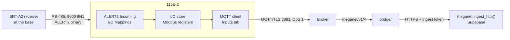

# Provisioning an ELPRO 115E-2 to publish into MegaNet over MQTT

This page covers one job: taking an ELPRO 115E-2 Ethernet I/O and Gateway from its
box to the point where a reading it publishes appears in `meganet.reading`.

It is written in two halves that are done by two different people, and the halves
are kept apart deliberately:

| Part | Who | Where | Roughly |
|---|---|---|---|
| **[Part A](#part-a--system-administrator)** | **System administrator** — you | Broker console, Supabase SQL editor, GitHub, a spreadsheet | Once for the network, then a few minutes per station |
| **[Part B](#part-b--field--bench-technician)** | **Field / bench technician** | At a bench, with the unit, a USB cable and a Windows laptop | ~1 hour per unit, first time longer |

Part A produces a **credentials sheet**; Part B consumes it and produces a
**returned record**. Neither half can finish without the other, and neither needs
to understand the other's tools — that is the point of splitting them.

**Related pages.** [`ingest-mqtt.md`](ingest-mqtt.md) is the design — the topic
scheme and why it is shaped the way it is. [`mqtt-provisioning.md`](mqtt-provisioning.md)
is how the broker and bridge get stood up, which is a prerequisite for this page and
is not repeated here. [`bridge/README.md`](../bridge/README.md) is the subscriber's
own manual.

**Source and citation convention.** Every ELPRO fact below is cited to a **PDF page
number** of [`archive/EL-115E-2_User-Manual_April26.pdf`](../archive/EL-115E-2_User-Manual_April26.pdf)
(76 pages), written `(p.40)`. Do **not** use the manual's own table of contents or
cross-references: they run as much as 12 pages out from the printed page numbers, and one
cross-reference reads "see 'Feature license keys' on page 4461". MegaNet facts are
cited to `file:line`.

---

## Read this before you buy anything

**A 115E-2 in its default MQTT configuration cannot deliver a reading to MegaNet.**
This is not a tuning problem, and it is the single most important thing on this page.
There are two independent blocks, and each is enough on its own.

**1 · The topic.** MegaNet's bridge subscribes to exactly three filters and nothing
else ([`bridge/src/topics.js:104-108`](../bridge/src/topics.js)):

```
meganet/v1/+/+/reading
meganet/v1/+/+/reading/hfem
meganet/v1/+/status
```

The `meganet/v1` prefix is a compile-time constant (`topics.js:51-53`), not a
setting — there is no environment variable, config key or flag for it anywhere in
the bridge. A message published outside those filters is never forwarded to the
bridge by the broker at all: not rejected, not logged, not counted. And the
per-station broker ACL is `topic write meganet/v1/<publisher>/#`
([`bridge/deploy/mosquitto.acl.example:46-54`](../bridge/deploy/mosquitto.acl.example)),
so the broker refuses the publish before it is even accepted.

**2 · The payload.** The bridge runs `JSON.parse()` on the body and treats a failure
as a permanently unstorable message ([`bridge/src/messages.js:66-81`](../bridge/src/messages.js)).
Sparkplug B — which is what ELPRO promotes for this device (p.6, p.40) — is Google
Protocol Buffers, i.e. binary. `JSON.parse()` throws on it every time. The bridge then
acknowledges the message, discards it, logs `message_unparseable` at error level and
counts it rejected. **There is no Sparkplug, protobuf or `spBv1` code anywhere in this
repository**, and the design says so on purpose: growing the accepted format list
"means teaching messages.js the shape first" (`topics.js:66-70`).

> **This is not a new discovery, it is a repeat.** MegaNet's one working MQTT base
> station is a Campbell CR300, and its commissioning notes say of the vendor's own
> built-in publisher: "**Automatic publishing / publish tables — Off.** It emits
> CSIJSON on the base topic, which is neither the scheme nor the payload the bridge
> accepts — every message it sends is one the bridge logs as unparseable and counts
> as rejected" ([`logger/README.md:220`](../logger/README.md)). That base station
> works only because its CRBasic program builds the whole topic and the whole JSON
> body itself, bypassing the vendor publisher entirely.

### The question that decides everything, and how to answer it

The 115E-2's other mode — "standard MQTT" with a configurable **Topic Prefix** — might
work. Three things must all be true, and **the ELPRO manual answers none of them**,
because it defers every operational MQTT detail to a *separate MQTT Configuration
manual* (p.40 once, p.41 three times — with no document number, version or URL given).

| # | Must be true | What the manual says |
|---|---|---|
| a | The device can emit the **full literal five-segment topic** `meganet/v1/<station>/<device>/reading` — not a prefix with vendor structure appended. A sixth segment is accepted only when it is `hfem`; any other sixth segment, or a seventh, parses as `unknown` and is dropped. | Only "Topic Prefix — For standard MQTT, you need to configure a topic" (p.40). **No example topic string anywhere**, and no statement of what is appended below the prefix. |
| b | The body is JSON carrying `alert_id` (or `station_number` + `channel`), `reading_ts` and `value_raw` under **those exact key names**. The bridge does no renaming and no unit inference. | **The payload format is never specified anywhere in the manual** — not JSON, not protobuf, not raw values, for either mode. |
| c | QoS 1, retain off, ≤1,000 readings and ≤256 KiB per message. | The Broker tab section names **no** QoS, retain, client-id, keep-alive or Last Will field (p.41). |

**Resolve this on a bench before you buy a fleet or write a runbook.** Put one unit
in standard-MQTT mode, point it at a *plaintext* scratch broker on 1883, and capture
what it actually sends. That single test — an hour's work — tells you which of the
paths below you are on.

### The paths, and what each costs

| | Path | Cost | When it is right |
|---|---|---|---|
| **A** | **Configure the 115E-2 to emit the contract exactly.** | Zero MegaNet code. | If the bench test says the device can express a full five-segment topic *and* template its payload. By far the best outcome — get the separate ELPRO MQTT manual and check this first. |
| **B** | **Add a format segment + parser to the bridge**, in the spirit of `READING_FORMATS = ['json','hfem']`. | Small, idiomatic change. | If the device can hit `meganet/v1/<station>/<device>/reading/<newformat>` but not the JSON body. The design anticipates exactly this shape of change. |
| **C** | **A translation service** subscribing to the ELPRO's native topics and republishing into the scheme. | A second always-on process; a credential that can write as other stations, weakening per-station containment. **Breaks the Last Will** — the retained `{"online": false}` becomes the *adapter's* death, so a dead 115E-2 behind a live adapter looks online. | Works regardless of what the device can emit. The fallback, not the first choice. |
| **D** | **Sparkplug B decoding in the bridge.** | Net-new: protobuf dependency, `spBv1.0/#` subscription, a metric-name → address mapping table somebody maintains, NBIRTH/NDEATH reconciliation. Breaks the ACL model. | Only if a Sparkplug fleet is coming. The manual names no Group ID / Edge Node ID / Device ID field, so this cannot even be scoped from it today. |
| **E** | **Skip MQTT — poll the 115E-2 over Modbus TCP** and post to the existing HTTP ingest. | A poller that does not exist; polling not push; no Last-Will offline detection. | The register map *is* fully documented (pp.60–62) where MQTT is not. This is the only path whose device side carries no unknowns. |
| **F** | **Split the problem — do the status half separately.** | — | The status topic is only four segments and `parseStatus()` accepts plain `online`/`offline` text (`messages.js:189-200`). If the device can set an arbitrary will topic, QoS 1 and retain on, **offline detection can work even when the reading path cannot**. The two halves fail independently; test them independently. |

Everything after this point assumes you have chosen a path. The checklists are written
for path A or B, and remain almost entirely correct for C.

---

## What you are actually building

A 115E-2 in a MegaNet context is a **base station**, not a sensor. It has its own I/O,
but the data worth publishing arrives from the field over ALERT2 and lands in its
register store first:



Three joins have to be right, and they are owned by different people:

1. **ALERT2 → register.** The technician maps each ALERT2 station address and sensor
   ID to a Modbus register (p.51). Sysadmin decides the map; technician types it.
2. **Register → published value.** The MQTT **Inputs** tab publishes "a block of
   inputs ... by setting the count" (p.41). That is the entire documented description.
3. **Published value → MegaNet address.** Every reading MegaNet stores needs an
   `alert_id` (1–65535) or a `station_number` + `channel`. Something has to carry that
   through. **This is the join the manual gives you nothing for**, and it is why the
   register→reading map on the handover sheet exists.

> **Note what does *not* need solving.** A base station may publish readings for many
> field stations under its own topic. The reading carries its own address
> (`alert_id`), and MegaNet stores against that, not against the topic segment
> (`topics.js:41-45`). The topic segment only decides *who published* and which ACL
> applies. So one 115E-2, one credential, one topic prefix — and hundreds of field
> stations' readings inside it.

---

## The contract the device has to hit

This is the target. Print it and put it on the bench.

**A reading**

```
topic:   meganet/v1/<station>/<device>/reading
qos:     1
retain:  false
payload: {"alert_id": 6128, "reading_ts": "2026-08-19T04:15:00Z", "value_raw": 301}
```

The payload may also be an array of those objects, or `{"readings": [ … ], …}` with
shared defaults. Limits: **1,000 readings** and **256 KiB** per message
(`messages.js:35-39`).

| Field | Required | Notes |
|---|---|---|
| `alert_id` | one of these two | The ALERT/ALERT2 address, **1–65535**. This is the natural fit for a 115E-2 relaying ALERT2. |
| `station_number` + `channel` | one of these two | For a station with no ALERT address. `channel` is e.g. `"rain"`, `"level"`. |
| `reading_ts` | yes | ISO 8601 (`"2026-08-19T04:15:00Z"`) or epoch seconds/ms. Rejected if before 1990 (a dead clock) or more than a day in the future. |
| `value_raw` | yes | The value as measured. A reading carrying only `value` is accepted; one with neither is rejected. |
| `value`, `unit`, `quality` | no | `unit` comes from a fixed list (`mm`, `m`, `V`, `degC`, `NTU`, …) — an unrecognised one is a rejected row, not a guess. |

**Status and Last Will** — the half that is more likely to be achievable, and the
reason MQTT earns its moving parts at all:

| | Value |
|---|---|
| Topic | `meganet/v1/<station>/status` |
| QoS | `1` |
| Retain | **on** |
| Live payload | `{"online": true, "battery_v": 12.9}` — or just the text `online` |
| Will payload | `{"online": false}` — or just the text `offline` |

> **Both common defaults are wrong for us, and quietly.** A will at QoS 0 can be lost
> on the hop that matters; a will left *do not retain* is discarded the moment the
> bridge reconnects, so a bridge restart silently resurrects every dead station
> (`logger/README.md:240-244`). If the 115E-2 exposes Last Will fields at all, these
> two are the ones to get right.

**`<station>`** is the **bureau station number** for a gauging station. A base station
is an ingest point, never has a bureau number and never will, so it publishes under its
`stations.json` **station id** — the precedent in this repo is `18_bateson`. Either
resolves without a mapping table (`meganet.resolve_publisher()`, `0020`). Segments must
match `^[A-Za-z0-9][A-Za-z0-9._-]{0,63}$` — letters, digits, dot, dash, underscore, no
spaces.

**`<device>`** is which box at the site is talking: `logger` for the usual single box.
**It is not optional** — the reading topic is five segments, always.

---

## Part A — System administrator

Items 1–3 are a gate. Do not order hardware or brief a technician past them.

### A0 · The gate

1. **Get the separate ELPRO MQTT Configuration manual.** The 115E-2 manual defers to it
   four times (p.40, p.41 ×3) with no document number, version or URL.
   elprotech.com → Resources → 115E-2 → Documentation; raise a support ticket if it is
   not published. **Every operationally useful MQTT detail is in that document, not the
   one in `archive/`.**

2. **Resolve the Feature Key question in writing.** Page 5 reads: "The 115E-2 comes from
   the factory with ELPRO WIB, Modbus TCP/RTU, DNP3 (requires Feature Key), MQTT and
   Alert protocol (requires Feature Key) support as standard." That sentence can be read
   two ways. The weight of evidence says **MQTT is not licensed** — the MQTT chapter
   never mentions a key, while DNP3 (p.35) and ALERT2 (p.49) both do, and the
   specification table lists "MQTT +Sparkplug" unqualified (p.59). But confirm it with
   ELPRO or by reading the **Feature Keys** page on a real unit. If it *is* licensed,
   keys are bound to the module serial number and become a procurement lead time, not a
   configuration step.

   **The ALERT2 gateway is definitely licensed** (p.49) and needs firmware ≥ 2.33.
   If you are relaying ALERT2, budget for it.

3. **Run the bench test from ["Read this before you buy anything"](#read-this-before-you-buy-anything)
   and choose a path.** Record the choice and the captured topic string and payload
   bytes. This is the highest-value hour in the whole project.

### A1 · Fleet standards

4. **Fix a firmware version.** MQTT floor is **V2.33** (p.5); the manual in `archive/`
   documents **2.55 or later** with CConfig **2.1.0.72** (p.2). Firmware comes only from
   ELPRO technical support (p.67) — no public URL, no published checksum. Compute your
   own checksum, record it, and keep firmware plus configuration in the offsite backup
   the hardening appendix asks for (p.66).

5. **Register the base station in MegaNet and fix its publisher segment.** Confirm the
   exact string the database will resolve, before it is flashed into anything:

   ```sql
   select coalesce(nullif(station_number, ''), id) as publisher
     from meganet.station
    where enabled and deleted_at is null
      and id = '<your_base_station_id>';
   ```

   Get this wrong and readings still land — they carry their own addresses — while
   `meganet.station_health` quietly accrues a row keyed by a string that names nobody.

6. **Decide the `<device>` segment** for each box at the site. `logger` unless there is
   more than one.

### A2 · Broker and bridge

The full run is [`mqtt-provisioning.md`](mqtt-provisioning.md). What matters here:

7. **Confirm the broker.** TLS on **8883**, TLS 1.2 floor, `allow_anonymous false`,
   persistent sessions kept. On HiveMQ Cloud note 8883 (TLS, for devices) versus 8884
   (WSS, for the browser Web Client only — a 115E-2 cannot use it).

8. **Mint the station credential.** `station-<publisher>`, **publish/write** on
   `meganet/v1/<publisher>/#`, and nothing else. `write`, not `readwrite` — a logger has
   nothing to read here. Generate these from the database rather than typing them once
   there are more than a handful; the query is in
   [`bridge/deploy/mosquitto.acl.example:29-35`](../bridge/deploy/mosquitto.acl.example).

   > **Generating from the same column the database resolves against is what makes a
   > mistyped segment loud.** A credential may only write the topic its own number
   > spells, so a unit configured with `041564` instead of `41564` is refused by the
   > broker rather than filed under an identity nobody claims.

9. **Confirm the bridge credential** (`meganet-bridge`, **subscribe** on `meganet/v1/#`,
   writes nothing) and that the bridge is running with `MQTT_CLIENT_ID` pinned.

10. **Mint the MegaNet ingest token** if one does not exist, in the Supabase SQL editor:

    ```sql
    select meganet.create_ingest_token('mqtt bridge');
    ```

    Shown once, starts `mgn_`, only its hash is stored. To rotate:

    ```sql
    update meganet.ingest_token set revoked_at = now() where label = 'mqtt bridge';
    select meganet.create_ingest_token('mqtt bridge');
    ```

    **This token never goes on the technician's sheet.** It belongs to the bridge, not
    to the station. The station gets a broker username and password and nothing else.

### A3 · The two decisions the manual will not make for you

11. **The TLS posture — and state it unambiguously on the sheet.** The manual
    contradicts itself: p.41 says brokers "will normally require **either** TLS **or**
    Username/Password", then immediately requires, for **each** TLS broker, a **CA
    Certificate file**, a **Client Certificate file** *and* a **Client Private Key
    file**. Server-only TLS is never confirmed as supported.

    Decide which you are provisioning:
    - **(a) Server-only TLS + username/password** — one CA bundle for the fleet. Cheap.
    - **(b) Mutual TLS** — a certificate and private key issued per device. That is a
      PKI programme with issuance, expiry monitoring and rotation, for units that will
      outlive their certificates.

    **Name the CA bundle the device must trust**, in a file, on the sheet. Nothing in
    this repo specifies this for a third-party device — `MQTT_CA_FILE` covers only the
    bridge's own trust store. The technician's returned record settles which posture the
    hardware actually accepts.

12. **Build the register → reading map.** One row per published point. This is the join
    nothing else supplies:

    | ELPRO register | ALERT2 addr / sensor ID | Name | Type | Unit | MegaNet address |
    |---|---|---|---|---|---|
    | `46009` | `1234` / `1` | Loudoun Br river level | S-4 | `m` | `alert_id: 6128` |

    Recommended ELPRO register ranges for ERT-A2 work (p.51):

    | Value type | Range |
    |---|---|
    | Signed/unsigned 16-bit (S-2, U-2) | `40401`–`46000` |
    | Signed/unsigned 32-bit (S-4, U-4) | `46009`–`47999` |
    | Floating point (F-4) | `48005`–`49999` |

    **32-bit values occupy two 16-bit registers and may only be read on odd addresses.**
    A float at `46009` is followed by `46011`, then `46013`. Reading `46012` returns a
    Modbus address error (p.51).

    > **One known contradiction to settle on hardware:** the floating-point supply
    > voltages are given as 38005–38008 in the body (p.8), 38005–38012 "in volts" at
    > p.25, and 38009–38016 in the
    > appendix table (p.62). Do not publish either until IO Diagnostics confirms which
    > is live on your firmware.

### A4 · Network and policy

13. **Firewall.** Outbound **TCP 8883** from the base station to the broker. **Also open
    UDP 123 (NTP)** — NTP is *missing from the manual's port table* (p.66) even though
    the device has Enable NTP and NTP Server IP fields (p.48), and its real-time clock
    holds time for only "at least twelve hours (typical 3-5 days)" without power. A
    firewall built strictly from that table blocks NTP and silently breaks certificate
    validation after an outage. Keep **TCP 80** (configuration and dashboard, cleartext)
    off any untrusted path.

14. **Credentials policy.** New Admin and Manager passwords, minimum eight characters
    (p.44), per-person rather than shared, distributed out of band. Note that accounts
    **cannot be deleted — only "retired"** — and no rename function is documented (p.43–44),
    so `admin` and `user`
    remain as usernames whatever you do.

15. **Publish cadence and volume.** No MegaNet-side budget exists yet. HiveMQ's free tier
    is 100 connections / 10 GB a month / 5 MB messages, and `meganet.retain()` is still
    run by hand — the whole network at 15-minute reporting is roughly 914,000 rows a
    day, which fills the Supabase free tier in under a week. Pick a cadence deliberately.

16. **Asset inventory and network filtering rules.** Record manufacturer, type, serial,
    firmware and location (p.65). Prepare the IP whitelist rules to hand over —
    "Network Filtering" page, disable "Easy IP Filtering", add explicit rules (p.66).

17. **Issue the sheet** ([Part C](#part-c--the-handover-sheet)) and tell the technician
    which path from the gate is in force.

---

## Part B — Field / bench technician

You are at a bench with a 115E-2, a USB cable, a Windows laptop and a sheet from the
sysadmin. Work in this order. **Anything the sheet leaves blank, ring and ask — do not
guess.** Several steps ask you to *record* something; those answers fill gaps the ELPRO
manual leaves open, and they are as much the deliverable as the working unit.

### B1 · Before power

1. **Kit check.**
   - USB **A-to-B** cable — the module's port is USB-B, on the bottom of the unit (p.14–15).
   - **CConfig** installed (elprotech.com → Resource page → 115E-2 → Software), version
     per the sheet, ≥ 2.1.0.72 (p.2). "Standard Installation" replaces any existing
     CConfig; "Parallel Installation" keeps the old one alongside (p.14).
   - The **USB driver**, `Inst_Elpro_USB_Driver_2.0.0.2.exe_zip`, if you intend to use
     the web pages (p.42). Installing CConfig normally installs the drivers too (p.15).
   - The certificate files, the sheet, and somewhere to write.

2. **Read the side label and write it down now, before the unit is racked:**
   - the **serial number** (needed for any future feature key, and for a factory reset),
   - the **default IP** `192.168.0.1XX`, where `XX` is the last two digits of the serial (p.35, p.57),
   - the **individual password**, if this unit's label carries one (p.15).

   If the label becomes unreadable later, the serial number can still be read from the
   home page (p.48) or Modbus registers `30494`–`30496` (p.53), and the default IP follows
   from it — but only by someone who can already log in. **The individual label password
   has no documented recovery path at all.**

### B2 · Power and first connection

3. **Power on and wait for PWR solid green** — about 80 seconds. The sequence is red
   ~2 s → orange 12 s → fast red/green flash 30 s → slow flash 50 s → solid green
   (p.57). A factory-new unit should reach solid green.

4. **Connect over USB. It has to be USB the first time** — "On first connection, you must
   connect to the device through its USB port" (p.14, p.42), restated in troubleshooting
   as "When the unit is new from the factory, you can only configure the unit using the
   USB port" (p.57). Ethernet configuration access is off until someone turns it on, and
   **turning it on can only be done over USB** (p.15).

   Windows should recognise a device identifying as **"115E-2"** and add a network
   adapter called **"Elpro 115E-2 USB Ethernet/ RNDIS Interface"** (p.15).

   > If that adapter does not configure itself an address, stop and record it. The manual
   > gives no netmask for the USB link and no PC-side address to enter manually.

5. **Get in.**
   - **Web:** browser → `http://192.168.111.1`. That address is always the same, on every
     unit, and HTTP is always open on the USB port (p.42, p.66).
   - **CConfig:** Communications panel → **Program Unit** → connection dialog → **USB** →
     **Refresh** until USB Status shows "Connected" → username and password → **OK** (p.15–16).

6. **Log in, and record which credential worked.** Try in this order: `user`/`user`, then
   `admin`/`admin` (p.43–44), then the password printed on this unit's label. **The
   manual contradicts itself** — p.15 says the default depends on firmware ("V2.55 and
   earlier: `user`; V2.59 and later: check product label"), while p.16, p.42 and the
   default-users table all state it flatly as `user`. Your answer resolves it for this
   shipment. `admin` is the Admin role; `user` is Manager (p.43–44).

### B3 · Baseline the unit

7. **Read and record the firmware version** from the home page (p.49; also Modbus
   registers 30497–30499, p.53). **Below V2.33 the unit cannot do MQTT at all** (p.5) —
   stop and return it for upgrade.

8. **Upgrade if the sheet says to.** System Tools → **Firmware Upgrade** → browse to the
   patch file → **Send** → on success, **Reset** (p.47). Existing configuration is
   preserved. For a full USB upgrade follow p.67–69 exactly, and **do not interrupt
   power** — an interrupted upgrade means the unit goes back to ELPRO.

9. **Open Feature Keys and record exactly what the page lists**, in particular whether
   MQTT appears there at all. If the sheet includes a key: check the serial on the
   certificate matches the module label, enter the key, **Save Changes**, confirm a green
   checkmark (a red cross means invalid), then **Save Changes and Reset** (p.48–49).
   Feature keys survive a factory-default reset.

   > **Demonstration mode** enables all licensed features for 16 hours or until restart
   > (p.49). Useful for a bench test; never for commissioning.

### B4 · Harden and identify

10. **Change the default passwords now**, before anything else goes on the unit.
    **Change Password** for your own account, and **User Management → Password → Change**
    for the other default account. Minimum eight characters (p.44). The manual is blunt:
    "The 115E-2 should not be commissioned for production with Default credentials"
    (p.65). Finish with **Save and Activate Changes**.

11. **Module Information** (p.47): set **Device Name** to the exact string on the sheet —
    it must be unique across the fleet, because data-log directories are named after it
    (p.56). Fill in Owner, Contact, Description and Location from the sheet.

12. **Network settings** (p.43): enter **IP Address**, **Subnet Mask** and **Default
    Gateway** exactly as on the sheet. Static only — no DHCP option is documented
    anywhere.

13. **Date and Time** (p.48): tick **Enable NTP** and enter the **NTP Server IP** from the
    sheet, then **Save changes and activate**; the message beside the field updates to
    show whether it connected. If NTP is not available, set the clock manually **in UTC**
    — the device has no time-zone or daylight-saving support, and its clock is what your
    timestamps and TLS certificate validation both depend on.

14. **Remote access**, only if the sheet asks for it: in CConfig, on the device's main
    configuration page, tick **Remote access** — "Check this to enable remote
    configuration access to the device from the radio or Ethernet ports" (p.16).
    **This can only be done over USB** (p.15). Bear in mind that configuration traffic is
    plain HTTP on port 80 — there is no HTTPS option — so anything you type over Ethernet
    afterwards travels in the clear (p.65, p.66).

    Then apply the **IP whitelist** from the sheet, if it carries one: the **Network
    Filtering** page, **disable "Easy IP Filtering"**, and add an explicit rule per allowed
    remote device (p.66). **No chapter of the manual documents this screen** — only the
    hardening appendix names it — so record the menu path you found it under and the rule
    syntax it actually wanted.

### B5 · The ALERT2 gateway, if this unit is relaying ALERT2

Skip to [B6](#b6--mqtt) if the sheet does not mention ALERT2. This is web-page
configuration only — "Setup for the Alert protocols can only be done through Web page
configuration" (p.49) — and needs the ALERT2 feature key and firmware ≥ 2.33.

15. **Set up the incoming serial stream** (p.51). Choose **ERRTS IO Gateway** as the
    **RS-232** or **RS-485 Port Type**, then match the serial settings to the source:
    - ERT-A2 Receiver Base → **RS-485**, 9600, 8N1, no flow control
    - ELPRO ERRTS decoder chain → **RS-232**, 9600, 8N1, no flow control

    Then set **ALERT Protocol Mode** to **"ALERT2 In"** for ALERT2 binary, or
    **"ALERT In"** for legacy ALERT.

16. **ALERT2 Incoming I/O Mappings** — this is what puts field data into registers where
    MQTT can reach it. Click **Add Entry** for each line on the sheet's register map (p.51):
    1. Enter the **ALERT2 station address** in the source Address field.
    2. Fill the **four sensor ID columns**. Use **255** for any unused slot; if a station
       has more than four sensors, add a second line.
    3. Enter the **starting Modbus register**, using the correct range for the value type
       (32-bit for rain and river values, 32-bit float for SDI-12 variables).
    4. Apply **scale** and **offset** if the sheet specifies them — they apply to the
       whole line.

17. **Record any line you could not enter as written**, and why.

### B6 · MQTT

MQTT is documented only under **CConfig** — "Access the MQTT Configuration by selecting
MQTT on the tree view under the device" (p.40). The manual never says whether the web
pages can do it, in either direction, and the web role-privileges table has no MQTT row
(p.44). **Record which of the two you were actually able to use.**

18. **In CConfig**, add the unit if it is not already in the project (Units → **Add a new
    Unit**), configure it as a **base station**, then select **MQTT** on the tree view.

19. **Basic Configuration Items** — the four named fields (p.40):

    | Field | Set to | Note |
    |---|---|---|
    | **MQTT Enable** | on | MQTT, like every protocol on this device, is **disabled by default** (p.66). |
    | **Enable Sparkplug** | **off**, unless the sheet explicitly says otherwise | MegaNet cannot decode Sparkplug B. With Sparkplug on, the topic is generated automatically and you cannot author it. |
    | **Node Update** | the value on the sheet | "The update time for statistics, including device status." **No units, range or default are documented — record what the field shows and what you typed.** |
    | **Topic Prefix** | the literal string on the sheet | Then check what the device *actually* publishes (step 30). The manual never states what gets appended below the prefix. |

20. **Broker tab** (p.41): enter the broker hostname, port **8883**, username
    `station-<publisher>` and the password from the sheet. Up to four brokers are
    supported; you need one. Wherever the tab exposes them, also set the **client id** to
    the unique value on the sheet, **clean session off**, the **keep-alive** on the sheet,
    and readings to **QoS 1, retain off**. If a field on the sheet has no counterpart on
    the tab, **write that down** — it is one of the answers the sysadmin is waiting for.

    > **The manual names no field labels at all for this tab.** Write down the actual
    > labels you see, and specifically whether there is a **port** field, and whether
    > there are **client id**, **keep-alive**, **clean session**, **QoS**, **retain** or
    > **Last Will** fields. If Last Will fields exist, set will topic
    > `meganet/v1/<station>/status`, will QoS **1**, will retain **on**, will payload
    > `{"online": false}`.

21. **Security tab** (p.41): add the **CA Certificate file** from the sheet. If the sheet
    specifies **mutual TLS**, also add the **Client Certificate file** and the **Client
    Private Key file**; if it specifies **server-only TLS**, try the CA certificate alone
    with the broker username and password, and see whether the device accepts it. The
    manual demands all three for every TLS broker but also says brokers need "either TLS
    or Username/Password" — which of those is true on real hardware is the answer the
    sysadmin needs back.

    > **Record whether server-only TLS was accepted** — CA certificate alone plus
    > username and password — or whether the client certificate and key were genuinely
    > mandatory. Also record which **file formats** were accepted and rejected, and
    > whether the tab holds one file set for the whole device or one per broker. The
    > manual states none of this, and the answer decides whether the fleet needs a PKI.

22. **Device tab** (p.40–41): create the logical device(s) named on the sheet.

23. **Inputs tab** (p.41): set the **count** for each block of inputs to publish, per the
    sheet's register map. The manual documents only a count — "You can configure a block
    of inputs to be published by setting the count" — and never says how the block's
    **starting** register is chosen. **Record whether a start-address field exists, what
    it is labelled, and if there is none, which registers the tab actually publishes.**

24. **Outputs tab** (p.41): leave it alone unless the sheet says otherwise. MegaNet's
    bridge publishes nothing and sends no commands, so there is nothing to subscribe to.

25. **Commit** — **Program Unit** in CConfig (p.16), or **Save and Activate Changes** on
    the web pages (p.44). **Record whether the unit rebooted, how long it was offline,
    and whether you lost your session.** The manual does not say.

### B7 · Verify on the bench, before it leaves

26. **LEDs** (p.57–58): **PWR solid green** (system OK), **LAN green** (connected), and at
    the Ethernet socket **100M green** (100 Mbps link) and **LINK orange** (activity).
    **There is no MQTT LED** — the front panel cannot tell you the broker is connected.

27. **Ping the unit** from the laptop at its new address (p.57).

28. **Statistics page → TCP/UDP Statistics** — "This section lists all open ports" (p.66).
    Record what is listening; confirm nothing unexpected is.

29. **CConfig → MQTT Comms** (p.16) — the only MQTT-specific diagnostic on the device:
    it "allows you to monitor MQTT traffic received and transmitted by the device's
    Ethernet and Radio ports". **Record its output verbatim.** The manual says nothing
    else about it, so what you write down here is the documentation.

30. **Capture IP Comms** (p.54): Network Diagnostics → **Capture IP Comms** → **Start**,
    trigger a publish, then **Stop and Download** and open the file in Wireshark. Capture
    stops itself at 20,000 packets.

    > **On 8883 you will see the TLS handshake, not the payload.** That is still the
    > evidence you need if the handshake fails. **To read the actual topic string and
    > payload bytes — the most valuable line on the returned record — do one bench run
    > against a plaintext scratch broker on 1883 first.**

31. **IO Diagnostics** (p.52): enter a **Register** address and a **Count**, click
    **Read**, and compare the values against the register map. Watch for the flags:
    - `~` — the register is in the **Invalid** state. Mappings that include an invalid
      register are not sent at all.
    - `*` — the register is at its **fail-safe** value.

    Record the raw values and any flags. This is what lets the sysadmin check the value on
    the wire against the value in the device.

32. **Export the configuration.** System Tools → **Read Configuration File** → **Entire
    unit Configuration** → **Download** (p.47). This is the unit's backup and the seed for
    the next one. Record the filename and the **Config Version** timestamp from Module
    Information.

33. **Ring the sysadmin and stay on the line** while they run the SQL in
    [Part D](#part-d--proving-it-works). **Do not pack the unit until they confirm a row.**

34. **Complete the returned record** ([Part C](#part-c--the-handover-sheet)) and hand it back.

---

## Part C — The handover sheet

### C1 · Sysadmin → technician

Every field must be a **literal value**, not a description. Anything left blank becomes a
guess at the bench.

**Identity**
- `<station>` publisher segment — exact string. *Type exactly: leading zeros matter;
  letters, digits, dot, dash, underscore only; 64 characters maximum.*
- `<device>` segment — normally `logger`.
- Device Name for Module Information, plus Owner / Contact / Description / Location.

**Topics, written out in full**
- Reading: `meganet/v1/<station>/<device>/reading`
- Status and Last Will: `meganet/v1/<station>/status`, **QoS 1**, **retain on**,
  will payload `{"online": false}`

**Broker**
- Hostname; port `8883`; TLS 1.2 minimum
- Username `station-<publisher>` and password
- MQTT client id — **unique network-wide**; two clients sharing one id knock each other
  off the broker in a loop
- Clean session **off**; keep-alive value
- Readings: QoS **1**, retain **off**

**TLS material**
- CA bundle: filename, how supplied, expected format
- Client certificate and private key, if mutual TLS is in force; whether the key may be
  passphrase-protected
- Expiry dates and who to contact for renewal

**Network**
- IP address, subnet mask, default gateway
- NTP server IP
- Whether Remote access (Ethernet configuration) is to be enabled

**Device MQTT settings**
- Topic Prefix — the literal string to type
- Enable Sparkplug — **off**, or the explicit exception
- Node Update — the value to enter
- Logical device(s) for the Device tab

**ALERT2 gateway**, if applicable
- Port (RS-232 / RS-485), baud, data format, ALERT Protocol Mode
- One row per mapping: ALERT2 station address, up to four sensor IDs (255 for unused),
  starting Modbus register, scale, offset

**Register → reading map**, one row per published point
- ELPRO register, ALERT2 address/sensor, name, type, unit, MegaNet address
- The required JSON key names spelled out: `alert_id`, `reading_ts`, `value_raw`, and
  optionally `value`, `unit`, `quality`

**Credentials and policy**
- New Admin and Manager passwords, or the policy plus a sealed envelope
- CConfig version to install (≥ 2.1.0.72)
- Firmware target, patch or full file, checksum, and which upgrade method
- Feature key value(s) and certificate, with the module serial they are bound to
- Network Filtering / IP whitelist rules

**Escalation**
- Your name, phone, and the window in which you will be watching the broker and running
  the SQL.

### C2 · Technician → sysadmin

**Asset facts**
- Module serial number, firmware version and patch level, CConfig version used
- Configured IP / mask / gateway, Device Name, Config Version timestamp
- Filename and location of the exported configuration
- Commissioning date and technician name

**Answers that close gaps in the ELPRO manual** — this is why the record exists
- Which default password worked
- What the **Feature Keys** page listed, and whether MQTT was on it
- Whether MQTT was reachable **from the web pages**, or only from CConfig
- The **exact field labels on the Broker tab**, and whether a port field exists
- Whether the Broker tab exposed client id / keep-alive / clean session / QoS / retain /
  **Last Will** fields, and their labels
- Whether **server-only TLS was accepted**, or client certificate and key were mandatory
- Certificate **file formats** accepted and rejected; one file set globally or one per broker
- **Node Update**: units shown, range accepted, default it arrived at
- **The actual topic string the device published** — the single most important line here
- **The actual payload bytes** the device published, hex or text
- Whether Program Unit / Save and Activate caused a reboot, and for how long

**Evidence**
- Open ports from Statistics → TCP/UDP Statistics
- MQTT Comms output, verbatim
- IO Diagnostics values for every register on the map, with any `~` or `*` flags
- Any Capture IP Comms file, and whether the TLS handshake completed
- LED state at handover: PWR, LAN, 100M, LINK

**Deviations** — anything on the sheet that could not be done as written, and what was
done instead.

---

## Part D — Proving it works

### D1 · Sysadmin side, before the device exists

Prove the MegaNet half on its own, so that when the device fails you already know it is
not this half.

1. **Broker and ACL.** In the HiveMQ Web Client (port **8884**, `wss://` — a browser
   cannot use 8883), publish as `station-<publisher>` to
   `meganet/v1/<station>/logger/reading`, QoS `1`, retain off:

   ```json
   {"alert_id": 6128, "reading_ts": "2026-08-19T05:30:00Z", "value_raw": 301}
   ```

2. **Negative ACL test — the half nobody runs.** With the same credential, publish to
   `meganet/v1/<some other segment>/logger/reading`. **The broker must refuse it.** If it
   succeeds, the credential is over-scoped; go back to A8.

3. **Did it land?**

   ```sql
   select addr, reading_ts, value_raw, source, dup_count
     from meganet.reading order by received_at desc limit 5;
   ```

   Republish the identical message: **no new row appears, `dup_count` increments
   instead.** That is the primary key (address, instant, value) eating the duplicates
   that QoS 1 guarantees — and it is why this design does not need QoS 2.

4. **Station health.**

   ```sql
   select station_key, station_id, online, since, last_reading_at
     from meganet.station_health where station_key = '<publisher>';
   ```

   A row keyed by a bare string nobody can name means the segment resolves to no station —
   check it against `meganet.station.station_number` and `meganet.station.id`.

5. **Bridge alive, and told apart from a quiet field.**

   ```sql
   select bridge_id, connected, last_message_at, last_insert_at, pending,
          now() - last_seen_at as silent_for
     from meganet.bridge_health;
   ```

   `silent_for` growing past a couple of minutes means the process is gone.
   `last_message_at` old but `last_seen_at` fresh means the bridge is fine and the *field*
   has gone quiet — a different problem, with different people to wake.

### D2 · The joint test — do it once, on the phone

The technician triggers a publish while you watch the broker Web Client subscribed to
`meganet/v1/#`, then run the queries above. There are exactly three outcomes and each has
a different owner:

| What you see | What it means | Whose problem |
|---|---|---|
| **Nothing in the Web Client** | The broker refused it — ACL, credential or topic — or TLS never completed. | Technician's side. Evidence is Capture IP Comms and MQTT Comms. |
| **In the Web Client, but no row in `meganet.reading`** | The topic or payload does not match the contract. Read the bridge log: `topic_ignored` names the topic and why; `message_unparseable` names the payload problem. | This is the gate question, answered on real hardware. The captured topic and payload bytes go straight onto the returned record. |
| **A row appears** | Confirm `addr`, `reading_ts`, `value_raw` and `source` match what IO Diagnostics showed on the device. Then republish identically and confirm `dup_count` rises rather than a second row appearing. | Done. |

**Do not pack the unit until the third outcome has happened at least once.**

### D3 · The four bridge log lines that matter

```
subscribed              the three filters, at connect
subscribe_downgraded    ERROR — the broker granted QoS 0; at-least-once is off. Fix at the broker.
topic_ignored           WARN  — published under meganet/v1/… with the wrong shape. Constant = a topic typo.
message_unparseable     ERROR — the topic matched but the body did not.
```

Those last three are exactly how a misconfigured 115E-2 presents, and they are
distinguishable: broker-side refusal leaves **nothing at all** in the bridge log; a wrong
shape under the right prefix gives `topic_ignored`; the right topic with the wrong payload
gives `message_unparseable`.

**In none of these cases is the device told anything.** MQTT gives a publisher no reply
channel — the PUBACK it receives is from the *broker*, and means the broker has the
message, not that MegaNet does.

### D4 · Fire a Last Will deliberately

Do this once before the unit goes to the field. It is the whole reason MQTT earns its
extra moving parts here: offline detection with no polling. Kill the device's connection
ungracefully — pull the Ethernet cable, do not disconnect cleanly — and confirm that
`station_health.online` goes false and `since` moves to the moment the broker noticed.

> A clean disconnect tells the broker **not** to send the will, which is correct
> behaviour and exactly not what you are testing.

---

## Part E — What the manual does not tell you

Nothing in this section may be presented to anyone as known. It is here so that a gap is
recognised as a gap rather than mistaken for something you failed to find.

### E1 · MQTT

| Unknown | Why it blocks work |
|---|---|
| **The payload format** — no statement of JSON, protobuf or raw values, for either mode, anywhere in the manual. | The highest-priority unknown. Ingest cannot be written or tested against an unknown wire format. |
| **The topic grammar below Topic Prefix** — no example topic string; no statement of what segments are appended, in what order. The Outputs tab's "defined subscribe topic" is never defined. | Decides outright whether path A is possible. |
| **Every Broker tab field name** — no host, port, client id, username, password, keep-alive, QoS, retain, clean session, Last Will, reconnect or retry field is named. | No click-by-click instruction can be written for the one screen that matters most. |
| **Whether the MQTT port is configurable.** 1883/8883 appear only in the p.66 firewall table and — unlike Modbus, DNP3 and serial — carry **no "(Default, Configurable)"** annotation. | If the broker ever moves off 8883, it is unknown whether the device can follow. |
| **TLS detail** — no file format (PEM/DER/PKCS#12), no size limit, no upload control, no statement of whether the file set is global or per-broker, no TLS version, no cipher suite, no hostname-verification statement, nothing on passphrase-protected keys. | Certificates must be issued in a format the device accepts. Getting it wrong is a site revisit. |
| **Whether mutual TLS is mandatory** (the p.41 contradiction). | Decides whether this is a shared-password rollout or a per-device PKI programme. Highest-impact ambiguity for effort. |
| **Whether MQTT needs a Feature Key** (the p.5 ambiguity). | If licensed, every unit needs a serial-bound purchased key — a procurement lead time. |
| **Whether MQTT is configurable from the web pages**, and which role may change it. | Decides whether field staff need a Windows laptop with CConfig at every site. |
| **Sparkplug identity** — no Group ID / Edge Node ID / Device ID field named, no namespace derivation, no spec version, no NBIRTH/NDEATH behaviour. | Path D cannot be scoped from this manual. |
| **How Inputs map to registers** — "a block of inputs" with a "count" is the entire description. No start-address form, no data types, no statement of whether scaling applies (as it explicitly does for DNP3, p.39), no statement of whether change-of-state drives MQTT publishing or only WIB. | This is the join between the I/O store and MegaNet, and it is one sentence long. |
| **Node Update** — no units, no range, no default. Nor a default for MQTT Enable or Enable Sparkplug, nor a maximum number of logical devices. | Message rate — so broker load and row volume — cannot be predicted. |
| **MQTT diagnostics** — MQTT Comms is one sentence, with no field list, no error codes and no connection-state indicator. There is **no MQTT connection-status register** anywhere in the register map, **no MQTT LED**, and no statement of whether MQTT failures reach the system log or can drive a Comms Fail output — although WIB mappings, Modbus client mappings and expansion I/O all have such registers. | A technician cannot answer "is this unit connected to the broker right now?" from the device. Nothing device-side can be alarmed on. |
| **Store-and-forward.** DNP3 is credited with "timestamped data and history backfill" (p.6); nothing says whether MQTT publications are timestamped or buffered while the broker is unreachable. | Decides whether MegaNet sees gaps or backfill after an outage. |
| **Whether certificates and keys survive a factory reset, a firmware patch or a config restore**, and whether private keys travel inside the exported XML. Feature keys are stated to survive; certificates are never mentioned. | Decides whether a field reset costs a re-provisioning visit, and whether a decommissioned unit still holds a live key. |

### E2 · General provisioning

- **"Configuring the Region"** is in the table of contents but **no such section exists in
  the document body**. If a regulatory-domain setting must be chosen, there are no
  instructions, no field name, no valid values and no default.
- **VLAN Configuration** is in the contents and the hardening appendix points to
  "Advanced Networking >> VLAN", but **no VLAN section exists**.
- **"Network Filtering" and "Easy IP Filtering"** are named only in the appendix (p.66);
  no chapter documents the screen or the rule syntax. The appendix's central network
  recommendation cannot be followed step by step.
- **The "Statistics Page"** is referenced only in the appendix; no chapter shows its menu
  location. The one documented way to verify what is listening cannot be navigated to.
- **DHCP** is never mentioned outside the glossary. Network settings offer IP, mask and
  gateway only.
- **The literal default IP** is only ever "192.168.0.1XX (shown on the printed label)".
  There is no procedure for a unit whose label is missing — and the factory-reset
  procedure itself requires typing the serial number, which is also on the label.
- **The USB link's netmask and the PC-side RNDIS address** are never stated.
- **No HTTPS for management, anywhere.** Every documented URL is `http://`, and the
  appendix confirms HTTP "is not secured from eavesdropping" (p.65). Provisioning should
  be over USB, a VPN or a jump host.
- **The web server and USB HTTP service cannot be disabled** — "HTTP access is always open
  on the USB port" with no opt-out (p.66). The dashboard's "Display Configuration Page
  Link" checkbox is cosmetic; the page stays reachable at `http://<IP>/operator/main.asp`
  (p.26).
- **Bulk provisioning from a template is unaddressed.** A configuration can be exported
  "for upload to another unit" (p.47), but the manual never says which settings are
  unit-specific afterwards, whether the export contains the IP address and user accounts,
  whether the CConfig XML and the web download are interchangeable, or whether loading a
  file overwrites users and passwords. **Treat a cloned configuration as needing IP, Device
  Name, MQTT topic/client id and credentials re-checked by hand, every time.**
- **Whether committing an MQTT or network change reboots the unit** is never stated. The
  routing-rules note says only to click Program Unit "for the changes to take effect" (p.16),
  while a reset *is* explicitly required after a firmware patch (p.47) and after entering a
  feature key (p.49).
- **Password policy beyond eight characters** — no maximum, no complexity rule, no reuse
  rule, no lockout, no rate limiting. Accounts cannot be deleted, only retired, so "remove
  unused accounts" cannot literally be followed.
- **No remote or central logging** — no syslog, no SNMP traps. Logs come out by browser
  download or USB stick only.
- **NTP has no entry in the port table** although the feature exists and TLS depends on the
  clock.
- **FTP** appears in the specification table (p.59) with no port, no configuration screen
  and no enable/disable control anywhere.
- **Parts of the hardening appendix are inherited from a radio product** — "Protect your
  SSID", radio encryption keys, "the radio channel" — and do not apply to this wired
  gateway. It cannot be used as a literal checklist.
- **Two naming conflicts to expect:** System Tools lists "**Factory Default Configuration
  Reset**" (p.47) while the reset procedure says press "**Clear Configuration and Reset**"
  (p.56); and that procedure names the rebooting product as "The 215U-2".

### E3 · Not in MegaNet either

- **No topic prefix, rewrite or template setting exists in the bridge.** If the device
  cannot emit the literal topic, that is a code change, not a provisioning task.
- **No Sparkplug B / protobuf decoder**, and no vendor-payload key-mapping layer. The
  bridge deliberately does no renaming and no content sniffing.
- **No ELPRO precedent at all.** The only worked MQTT base station in this repo is a
  Campbell CR300 running custom CRBasic. This page is first-of-kind.
- **No position on offline detection for field stations behind a relay.** The status and
  Last Will scheme is per-`<station>` topic segment, so a base station's will covers only
  **the base station**. Readings for many field stations flow fine underneath it, but
  whether those stations get their own liveness identity is undecided — and the same gap
  exists for the CR300.
- **No statement of which CA a third-party device must trust** for the managed broker.

### E4 · Decisions only a person can make

1. Which path (A–F) is funded and owned.
2. Whether client certificates are required per device — and therefore whether a PKI
   programme is in scope.
3. Who owns certificate issuance, expiry monitoring and rotation for units that will
   outlive their certificates.
4. The publisher segment for each base station, and who confirms it in `meganet.station`
   before it is flashed into the device and the broker ACL.
5. Whether field stations behind a relay get their own status identity.
6. The fleet firmware version and the patch-management SLA.
7. Publish cadence, and the Supabase row budget that follows from it.
8. Whether provisioning is USB-only on the bench or staged over Ethernet — the manual
   reconciles neither, and this drives the whole rollout schedule.

---

## Reference

### Factory defaults

| | Value | Cite |
|---|---|---|
| USB address | `http://192.168.111.1` — always, on every unit | p.42 |
| Ethernet IP | `192.168.0.1XX`, where `XX` is the last two digits of the serial number, from the side label | p.15, p.35, p.42, p.57 |
| Subnet mask | `255.255.255.0` | p.15, p.42 |
| Users | `admin`/`admin` (Admin), `user`/`user` (Manager) — **but see p.15 on FW ≥ 2.59, where the password is printed on the label** | p.43–44, p.15 |
| Password minimum | 8 characters | p.44 |
| Protocol state | **All protocols disabled by default** | p.66 |
| Config access | USB only until Remote access is enabled — and it can only be enabled over USB | p.14, p.15, p.42, p.57 |
| Boot time | ~80 s to PWR solid green | p.57 |
| USB driver | `Inst_Elpro_USB_Driver_2.0.0.2.exe_zip` | p.42 |
| Firmware floor for MQTT | **V2.33**; this manual documents 2.55+ with CConfig 2.1.0.72 | p.2, p.5 |

### Ports (p.66)

| Protocol | Port |
|---|---|
| **MQTT** | **TCP 1883**, **TCP 8883 (TLS)** — *not* annotated configurable |
| Modbus | TCP 502 (default, configurable) |
| ELPRO WIB | UDP 4370 |
| Serial transfer | TCP/UDP 24 (default, configurable) |
| DNP3 | TCP/UDP 20000 (default, configurable) |
| Remote configuration and dashboard | TCP 80 (HTTP, cleartext) |
| NTP | **Not listed — open UDP 123 anyway** (p.48) |

### Register map (p.21, p.51)

| Type | Size | Base address |
|---|---|---|
| Discrete outputs | 6000 bits | `00001` |
| Discrete inputs | 6000 bits | `10001` |
| Word inputs (16-bit) | 6000 words | `30001` |
| Word outputs (16-bit) | 6000 words | `40001` |
| Long inputs (32-bit) | 1000 | `36001` |
| Float inputs (32-bit) | 1000 | `38001` |
| Long outputs (32-bit) | 1000 | `46001` |
| Float outputs (32-bit) | 1000 | `48001` |

On-board points worth publishing: `30005` supply voltage, `30006` 24 V loop, `30007`
battery voltage, `30008` expansion I/O supply (all 0–40 V default scaling);
`30001`–`30004` analog inputs; `10001`–`10008` digital I/O as inputs.

ERT-A2 recommended ranges: **16-bit** `40401`–`46000`, **32-bit** `46009`–`47999`,
**float** `48005`–`49999`. **32-bit values sit in two 16-bit registers and read only on
odd addresses** — `46009`, then `46011`, then `46013`; reading `46012` is an address error.

### Recovering a unit

- **Web:** System Tools → **Clear Configuration and Reset** (listed on the System Tools
  page as "Factory Default Configuration Reset") (p.47, p.56).
- **DIP switch:** open the side access panel, set **DIP 6 on**, power-cycle, wait for solid
  green, connect **over USB only** to `http://192.168.111.1`, type the **serial number**
  into the box, set **DIP 6 back to off**, press **Recover Device**. Unplug and replug the
  USB cable to reconnect. All configuration is wiped; feature keys survive (p.49, p.56).

---

## Troubleshooting

| Symptom | Cause, in the order worth checking |
|---|---|
| Cannot reach `192.168.111.1` | The USB driver is not installed, or the RNDIS adapter did not appear. Check Device Manager for "Elpro 115E-2 USB Ethernet/ RNDIS Interface". The unit must be fully booted — PWR solid green, ~80 s. |
| Cannot reach the unit over Ethernet | Remote access is off, and it can only be turned on over USB. Also check the PC is on the same subnet, and that you have the right `192.168.0.1XX` from the label. |
| None of the default passwords work | Try the individual password on the module's side label (FW ≥ 2.59). Otherwise the unit has been configured before — factory reset, which needs the serial number from the same label. |
| No MQTT section in the tree | Firmware below V2.33 does not support MQTT at all. Check the version on the home page. |
| MQTT settings look right, nothing on the broker | MQTT Enable is off, or the protocol was never enabled — every protocol is disabled by default. Confirm 8883 outbound is open, and check the Statistics page for what is actually listening. |
| The broker refuses the connection | Wrong credential, or TLS. Capture IP Comms will show whether the handshake completed. Check the device clock — an out-of-date clock fails certificate validation, and the RTC only holds time for a few days without power. |
| The broker refuses the *publish* | The credential's topic filter does not cover the topic. A station credential may only write `meganet/v1/<its own segment>/#`. Compare the Topic Prefix against the segment the credential was minted for. |
| Publishes succeed; **nothing in the bridge log at all** | The topic is outside `meganet/v1/…`, so the broker never forwards it. This is the gate question — capture the actual topic string. |
| Bridge logs `topic_ignored` | The segment count is right but a segment is not usable — a space, a `$`, a leading dot or dash, or over 64 characters. A topic with the *wrong* segment count matches no subscription and leaves **nothing in the log at all** (the row above): `meganet/v1/<station>/<device>/reading` is **five**, and the device segment is not optional. |
| Bridge logs `message_unparseable` | The topic matched, the body did not — not JSON, wrong shape, oversized or empty. Capture the payload bytes against a plaintext broker on 1883 and compare against [the contract](#the-contract-the-device-has-to-hit). |
| Bridge logs `subscribe_downgraded` | The broker granted QoS 0. At-least-once delivery is not in force — fix it at the broker, not the bridge. |
| Reading lands, `dup_count` rises, no new row | Working as designed. You republished an identical (address, instant, value). Change the timestamp. |
| `station_health` row keyed by a bare string | That segment resolves to no station. Compare against `meganet.station.station_number` and `meganet.station.id` — most often a leading zero (`041564` vs `41564`). |
| A register reads with `~` beside it | The register is in the Invalid state. **Mappings containing an invalid register are not sent at all** — set an initial value via Fail-safe Block Configuration. |
| A register reads with `*` beside it | The register is at its fail-safe value. It will still be sent. |
| `PT401` from any RPC | The bridge's ingest token is wrong or revoked. Re-mint it (A10). |
| Firmware upgrade interrupted | The module may be unserviceable and has to go back to ELPRO. Never interrupt power during a USB upgrade. |

---

## What is still a person's job

The gate at the top of this page is not rhetorical. Until one 115E-2 has been put on a
bench, pointed at a plaintext broker and made to show what it actually publishes, this
document describes a provisioning process whose central step — *what do you type into
Topic Prefix, and what comes out the other side* — is unanswerable from the manufacturer's
own manual. Everything else here is ready to use; that one hour is what turns it from a
plan into a runbook.
