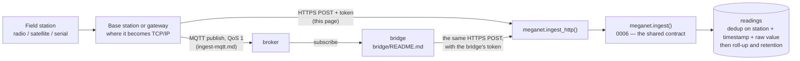

# HTTP ingest — posting readings from a base station

This page is for whoever is configuring a base station to send readings to
MegaNet. It assumes you have a serial cable and a datasheet for your device, not
that you have read this repository. If you are changing how the endpoint itself
works, the database side is `db/migrations/0007_ingest_http.sql`,
`db/migrations/0012_base_station_tokens.sql` and `db/README.md`.

> **Keeping this page true.** Every example here has been run against the live
> project (the #102 audit re-ran them all after its fixes). If you change an
> example, run it first — #99 existed because a wrong `curl` could survive
> review, and nothing forced anyone to execute it. The database checks CI runs
> on every push (`tools/check_ingest.sql`) hold the *contract*; only running
> the examples holds the *page*.

## The whole picture

Two ways in, one contract, one place where duplicates die. Whatever the
transport, every reading ends up as the same call:



What the two paths share is everything that matters: the payload shape, the
1,000-reading batch limit, the unit vocabulary, the rejection reasons, and the
token model — the bridge is just another ingest point holding another token.
**Deduplication happens in one place**, inside `meganet.ingest()`: the same
reading arriving twice — same address, same `reading_ts`, same `value_raw` —
is stored once, whichever door it came through, which is why retrying is safe
on both paths and why the two can even run side by side during a migration.
What the MQTT path adds is presence: a broker knows when a station stops
talking, and the HTTP path has no way to say so.

A device that speaks **HFEM** — the BoM field-event line format — enters by
either door too: the raw line publishes to its own MQTT topic segment and the
bridge decodes it, or a gateway decodes it and posts the JSON over HTTP with
`protocol: "hfem"` and the line kept in `frame`. Either way it converges on
the same `meganet.ingest()` call as everything above —
[`ingest-hfem.md`](ingest-hfem.md) is that page.

What is automated versus manual today, honestly: CI applies every migration
from zero and runs the ingest and MQTT check suites on every relevant push,
and the bridge's own tests run the same way — but `meganet.retain()` (the
retention sweep) is still run by hand, and the bridge itself is
complete-and-tested but not yet deployed anywhere. The readings you POST are
kept raw as well as resolved either way.

## One token per ingest point

**A token belongs to the base station, not to a field station.** Mint one token
for each place where radio, satellite or serial becomes TCP/IP — a base station
and its data logger, a PC on the end of a serial cable, a satellite gateway — and
that one token posts readings for **every station that ingest point can hear**.

You do not need a token per field station, and you should not mint one. Each
reading in a batch carries its own address — an ALERT ID, or a station number —
and MegaNet works out which station it belongs to from that. A base station
hearing forty sites sends one POST with forty readings in it and one token in the
header.

The trade to understand before you go further: a base station's token is worth
forty stations, not one. Revoking it silences all of them, and a leaked one can
write for all of them. Two things follow from that — every reading records which
ingest point wrote it, and revoking is instant — and both are covered below.

## The endpoint

```
POST https://jjprlritvhdqpvphfrnu.supabase.co/rest/v1/rpc/ingest_http
```

Every request needs four headers, and a JSON body with everything nested one
level under a `payload` key — PostgREST maps an RPC body's top-level keys to
the function's named arguments, and `ingest_http` takes exactly one argument,
called `payload`:

| Header | Value |
| --- | --- |
| `apikey` | `sb_publishable_PV9VjCM8NQeGAJMuwa5TKA_yX9GWacY` — identifies the project. Not a secret; it is committed to this repo and cannot read or write anything on its own. |
| `X-Ingest-Token` | Your base station's token — see **Getting a token**, below. This is the secret. |
| `Content-Type` | `application/json` |
| `Content-Profile` | `meganet` — MegaNet's tables live in their own schema, not `public`. Without this, PostgREST looks in `public`, finds no `ingest_http` there, and the request never reaches the database ([`db/README.md`](../db/README.md)). |

```sh
curl -sS -X POST \
  'https://jjprlritvhdqpvphfrnu.supabase.co/rest/v1/rpc/ingest_http' \
  -H 'apikey: sb_publishable_PV9VjCM8NQeGAJMuwa5TKA_yX9GWacY' \
  -H 'X-Ingest-Token: mgn_your-token-here' \
  -H 'Content-Type: application/json' \
  -H 'Content-Profile: meganet' \
  -d '{
        "payload": {
          "path": "MT_STUART",
          "readings": [
            {"alert_id": 6128, "reading_ts": "2026-08-11T04:15:00Z", "value_raw": 301}
          ]
        }
      }'
```

A working request answers `200` with a body that says what happened:

```json
{"accepted": 1, "duplicates": 0, "rejected": [], "raw_id": 4821}
```

There is no `204`. If the response body does not say `"accepted"`, the reading
was not stored — a logger that cannot tell "stored" from "silently dropped"
produces gaps nobody notices for a month, so this endpoint never answers that way.

### Why `X-Ingest-Token` and not `Authorization: Bearer`

If you have used a Supabase project before, you may expect the token to go in
`Authorization: Bearer <token>`. It cannot go there: Supabase's API gateway reads
that header as a login token and rejects anything that is not one, before your
request reaches the database at all — an ingest token sent that way is refused
every time, whether or not it is valid. `X-Ingest-Token` is an ordinary header
that passes straight through, which is where MegaNet actually checks it.

## Payload shape

`payload` — the value nested under the top-level `"payload"` key, not the POST
body itself — is one reading, an array of readings, or an object with a
`readings` array plus shared defaults for the batch:

```json
{
  "source": "http",
  "path": "MT_STUART",
  "readings": [
    {"alert_id": 6128, "reading_ts": "2026-08-11T04:15:00Z", "value_raw": 301},
    {"alert_id": 6129, "reading_ts": "2026-08-11T04:16:00Z", "value_raw": 12},
    {"station_number": "541155", "channel": "level",
     "reading_ts": 1786000500, "value_raw": 1.842, "unit": "m"}
  ]
}
```

**Those are three different stations, in one POST, under one token** — which is
the normal case for a base station, not a special one. Nothing in the batch names
a station: each reading's `alert_id` or `station_number` is the address, and
MegaNet resolves it. Send everything your base station heard since the last POST
and let the addresses sort it out.

The two shapes travel together on purpose, and the base station at 18 Bateson is
where that is exercised live: it relays ALERT2 addresses off the air *and*
reports four sensors wired to the logger's own terminals, which have no ALERT
address because there is no packet — so they report as `station_number` 999998
with a channel, in the same batches. See
[`live-end-to-end-test.md`](live-end-to-end-test.md) and
`db/migrations/0026_bateson_test_rig.sql`.

| Field | Required | Notes |
| --- | --- | --- |
| `alert_id` | one of `alert_id` or `station_number` | Your ALERT/ALERT2 address, 1–65535. A radio logger has this and no `channel`. |
| `station_number` | one of `alert_id` or `station_number` | A satellite or cellular station's number, if it has no ALERT address. |
| `channel` | with `station_number` | Which sensor at that station number — e.g. `"rain"`, `"level"`. Not used alongside `alert_id`. |
| `reading_ts` | yes | When the device took the reading. ISO 8601 (`"2026-08-11T04:15:00Z"`), or epoch seconds/milliseconds as a number. |
| `value_raw` | yes* | The value as your device measured it — a raw count, or an engineering value if that is all your device has. *A reading carrying only `value` is accepted — `value` stands in as the raw record — but send `value_raw` where the device has one; a row with neither is rejected. |
| `value`, `unit` | no | The converted engineering value and its unit, if your device (or you) already did the conversion. Units are from a fixed list — `mm`, `m`, `V`, `degC`, `NTU`, and others; an unrecognised one is a rejected row, not a silent guess. |
| `quality` | no | `good`, `suspect`, `estimated`, `bad`, or `missing`. Defaults to unstated. |

`source` and `path` may be set once at the top level and apply to every reading
in the batch, or set per-reading to override it. `source` defaults to `"http"`
if you leave it out entirely.

**A batch is at most 1,000 readings.** A larger one is refused outright — split
it into more than one `POST`.

**Retrying is safe.** The same reading posted twice — same address, same
`reading_ts`, same `value_raw` — is stored once. If your logger's connection
drops after it sent the request but before the response arrived, resend the same
batch; you will not get a duplicate. Do not build your own acknowledgement
protocol on top of this — the endpoint already gives you an idempotent retry.

## Errors

**One bad reading does not lose the rest of the batch.** Every reading is
checked on its own; a bad one comes back in `rejected` and the others are still
stored:

```json
{
  "accepted": 99,
  "duplicates": 0,
  "rejected": [
    {"i": 47, "why": "reading_ts 1970-01-01T00:03:00+00:00 is before 1990 — a dead clock, not a reading"}
  ],
  "raw_id": 4822
}
```

`i` is the reading's position in your `readings` array, counting from zero. The
most common `why` you will see in the field:

| Reason | Usually means |
| --- | --- |
| `reading_ts … is before 1990 — a dead clock, not a reading` | The logger's real-time clock has lost power and reset to 1970 (or similar). Check the battery backing the RTC, not the network. |
| `reading_ts … is more than a day in the future` | The clock is fast, or set to the wrong year. |
| `unknown unit: …` | A `unit` value that is not on MegaNet's list. Send `value_raw` without `unit`/`value` if you are not doing the conversion yourself. |
| `no address: a reading needs an alert_id, or a station_number for a station that has none` | Neither field was set. |
| `alert_id % is outside 1-65535` | Typo, or a value read from the wrong register. |

**A malformed request is a `400`, not a partial accept** — this is the caller
misunderstanding the contract, a different thing from a device sending one bad
reading. This assumes a **valid** token: `ingest_http` checks `X-Ingest-Token`
before it looks at the body at all, so an invalid token reports `401`
regardless of what the body says — swap in a real one to see this response.

```sh
curl -o /dev/null -w '%{http_code}\n' -X POST \
  'https://jjprlritvhdqpvphfrnu.supabase.co/rest/v1/rpc/ingest_http' \
  -H 'apikey: sb_publishable_PV9VjCM8NQeGAJMuwa5TKA_yX9GWacY' \
  -H 'X-Ingest-Token: mgn_your-token-here' \
  -H 'Content-Type: application/json' \
  -H 'Content-Profile: meganet' \
  -d '{"payload": {"readings": "not an array"}}'
# => 400 (with a valid token; an invalid one reports 401 first)
```

**No token, or a bad one, is `401`:**

```sh
curl -o /dev/null -w '%{http_code}\n' -X POST \
  'https://jjprlritvhdqpvphfrnu.supabase.co/rest/v1/rpc/ingest_http' \
  -H 'apikey: sb_publishable_PV9VjCM8NQeGAJMuwa5TKA_yX9GWacY' \
  -H 'Content-Type: application/json' \
  -H 'Content-Profile: meganet' \
  -d '{"payload": {"readings": []}}'
# => 401, no X-Ingest-Token header at all

curl -o /dev/null -w '%{http_code}\n' -X POST \
  'https://jjprlritvhdqpvphfrnu.supabase.co/rest/v1/rpc/ingest_http' \
  -H 'apikey: sb_publishable_PV9VjCM8NQeGAJMuwa5TKA_yX9GWacY' \
  -H 'X-Ingest-Token: mgn_made-up-and-invalid' \
  -H 'Content-Type: application/json' \
  -H 'Content-Profile: meganet' \
  -d '{"payload": {"readings": []}}'
# => 401, token does not match anything live
```

A token stops working **immediately** once it is revoked — there is nothing
cached and no lifetime to wait out. The next request with that token gets the
same 401 as one that never existed.

## What a token can and cannot do

A token unlocks exactly one thing: calling this endpoint. It cannot read
`meganet.reading`, `meganet.station`, or anything else — there is no path from
`X-Ingest-Token` to a `select` on anything. (The station list and the readings
themselves are separately public, reachable with the `apikey` above and no token
at all — that is a deliberate, pre-existing decision recorded in
[`db/README.md`](../db/README.md) and has nothing to do with this endpoint. A
compromised token adds no read access beyond what was already public.)

What it *can* do is write readings for any address, including addresses your base
station has never heard. Coverage is not enforced — there is no list of "the
stations this base is allowed to post for", and `alert_low`/`alert_high` on the
token record are a note, not a rule. Treat a base station's token as a credential
worth the whole network's write access, because that is what it is: keep it in a
config file the logger reads rather than typed into a script, and revoke it the
day the hardware leaves your control.

## Which base station wrote a reading

Every reading records the ingest point it arrived through, which is what makes a
shared token safe to run. If a base station is misconfigured, or its token leaks,
this is the query that says what it touched:

```sql
select t.label, r.station_id, count(*) as readings, max(r.received_at) as latest
  from meganet.reading r
  join meganet.ingest_token t on t.id = r.ingest_token_id
 where t.label = 'Mt Stuart base'
 group by t.label, r.station_id
 order by readings desc;
```

A null `ingest_token_id` means the reading did not come through this endpoint — a
backfill, or a manual entry by an editor. Readings stored before this was added
are null too.

## Getting a token

Token issuing is a database operation for now — there is no page in the app for
it, on the reasoning that a UI can wait until it is actually needed for a pilot
this size. Run this once, from the Supabase SQL editor or `psql`, as a role that
can reach `meganet` directly (the service key, or a direct connection — see
`db/README.md`):

```sql
select meganet.create_ingest_token('Mt Stuart base');
-- {"id": 3, "label": "Mt Stuart base", "token": "mgn_a1b2c3…"}
```

**Name it for the ingest point, not for a station it relays.** "Mt Stuart base"
is a label someone standing at the site would recognise; "Durikai rainfall" is
the name of one of the forty things behind it and will be wrong within a month.

**Copy the `token` value now.** Only its hash is stored; there is no way to look
it up again. If you lose it, mint a new one and update the base station.

Optionally record which station the ingest point *lives* at — a location, purely
so a future map can draw it. It does not restrict anything:

```sql
select meganet.create_ingest_token('Mt Stuart base', 'mt_stuart');
```

## Revoking a token

One `update`, from the same place you minted it:

```sql
update meganet.ingest_token set revoked_at = now()
 where label = 'Mt Stuart base';
```

It takes effect on the token's very next request — nothing is cached and there is
no lifetime to wait out.

**Revoking a base station's token stops every station behind it.** That is the
right thing to do the day the hardware is lost, sold, or handed to a contractor,
but do it knowing the reach: have the replacement token ready to load, because
between the two the whole site is off the air.

## Which stations have gone quiet

**Do not use `ingest_token.last_used_at` for this.** It tells you the base station
is alive, and it moves identically whether one of its forty stations stopped
transmitting or none did. It answers "is Mt Stuart base still calling home", which
is a real question but a different one:

```sql
select label, last_used_at, revoked_at
  from meganet.ingest_token
 order by last_used_at nulls first;
```

Per-station silence is `meganet.station_health`, which HTTP ingest and the MQTT
bridge both feed:

```sql
select station_key, station_name, minutes_since_seen, minutes_since_reading
  from meganet.station_health
 where minutes_since_seen > 180
 order by minutes_since_seen desc;
```

`minutes_since_seen` is time since anything at all arrived for that station,
**including a reading that was rejected** — a logger whose clock has died is
still transmitting. `minutes_since_reading` is time since one was actually
stored. The two diverging is the signature of a station that is on the air and
sending something MegaNet will not accept: check `rejected` in your POST
responses, not the radio path.

A `station_key` that looks like `a:6128` or `s:541155` rather than a station name
is an address MegaNet could not resolve to exactly one station — 604 ALERT
addresses in the current data are carried by more than one station, so it records
the address it has rather than guessing.

## Rate limiting

There isn't any, at the HTTP layer — PostgREST does not do it, and this project
does not run anything in front of it that could, yet. For a pilot's worth of base
stations this is an accepted trade, and a smaller one than it was per-station:
there are far fewer tokens now, each one is loaded by someone commissioning
hardware rather than handed out per site, and every reading carries the token
that wrote it, so an ingest point behaving badly is a query rather than a
guess. If it becomes a real problem, the fix is Cloudflare in front of the
endpoint, not application code — the same infrastructure already planned for the
app itself.
