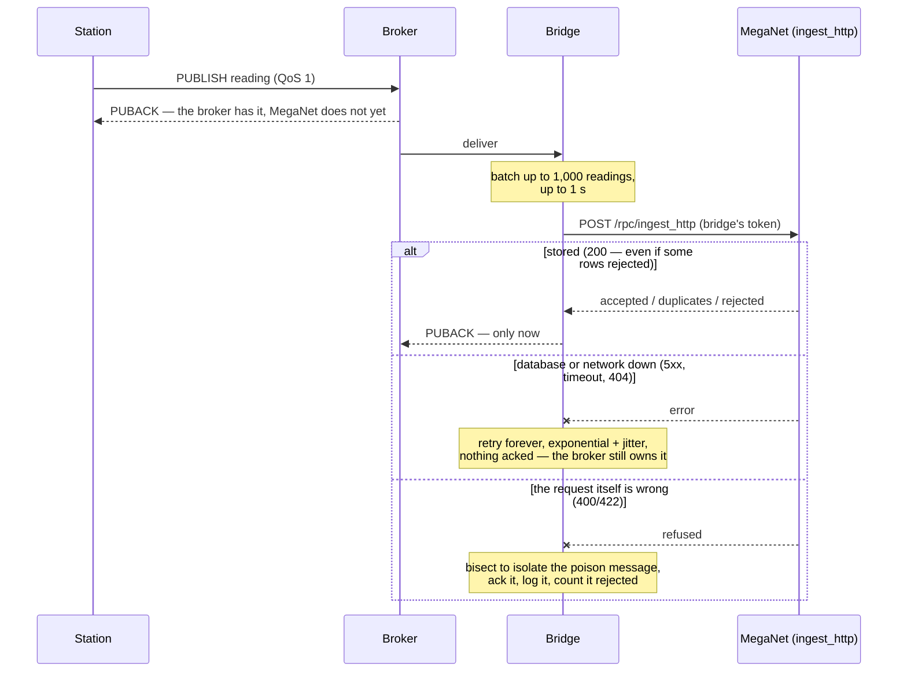
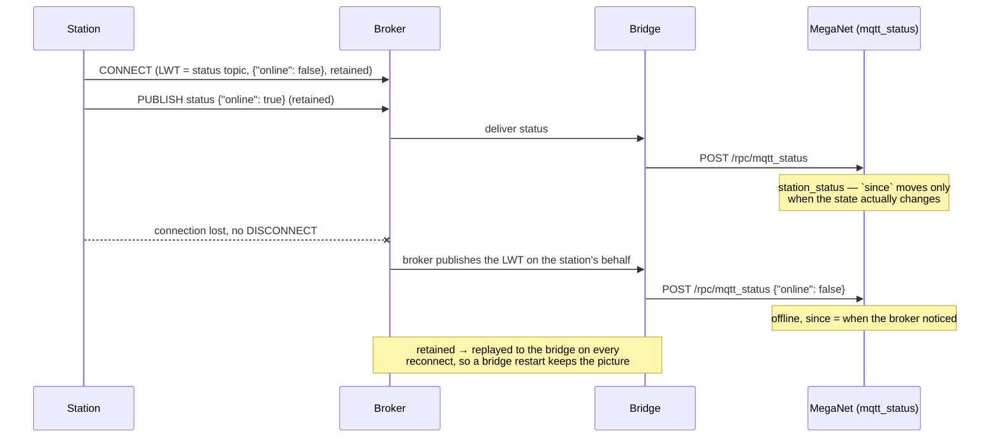

# MQTT ingest — the topic scheme, the broker, and the bridge

This page is for whoever is configuring a logger to publish readings over MQTT,
and for whoever has to decide where the broker lives. If you are changing how the
bridge itself works, that is [`bridge/README.md`](../bridge/README.md); the
database side is `db/migrations/0008_mqtt_bridge.sql` and `db/README.md`.

> **Keeping this page true.** The payload examples here are the exact shapes
> `bridge/test/` publishes through a real in-process broker on every CI run,
> and the #102 audit re-checked every claim on this page against the code —
> two of them were wrong and are fixed below, which is the argument for
> checking. If you change an example, run it (the bridge's integration test
> is the cheapest live-shaped target); prose alone let #99's wrong `curl`
> survive review.

**A logger that publishes this already exists**: [`logger/`](../logger/README.md)
is a CRBasic program for the Campbell datalogger at a radio base station, and it
sends every reading it hears over *both* paths — a POST and a publish. That is
not hedging: the primary key eats the second copy, so the duplicates are free,
and what the second path buys is the section on being alive below. Its
`README.md` is the commissioning guide, including the Device Configuration
Utility settings that hold the broker connection and the Last Will, none of
which CRBasic can see.

If your device speaks plain HTTP, use [`ingest-http.md`](ingest-http.md) instead
— it needs no broker and no bridge, and it posts the same reading object to the
same contract. If it speaks **HFEM** — the BoM field-event line format — that is
[`ingest-hfem.md`](ingest-hfem.md): the raw line publishes to its own topic
segment (`…/reading/hfem`, in the scheme below) and the bridge decodes it into
this same contract. **The whole picture — both paths converging on one contract,
and where duplicates die — is drawn at the top of
[`ingest-http.md`](ingest-http.md#the-whole-picture).** MQTT earns its extra moving parts on links where a device cannot
hold a TCP connection open long enough for a request/response, on radios where
1 byte of overhead matters, and — the real reason — because of what it gives back
in return: **you find out when a station stops talking**, for free.

---

## The thing to know up front

**Postgres cannot subscribe to MQTT, and Supabase does not host a broker.** So
MQTT ingest is two components, not one:

1. A **broker** the field stations publish to.
2. A **bridge** — a subscriber that receives, validates and calls
   `meganet.ingest()`.

The bridge is the first piece of MegaNet that has to run somewhere permanently.
Until this, everything was a static page plus a database. That is a real change
in the project's shape and it is worth being deliberate about, which is what this
page and `bridge/README.md` are for.

---

## The topic scheme

Design it once. Topics get burned into logger firmware, and changing one means
visiting sites.

```
meganet/v1/<station>/<device>/reading          device → us, QoS 1 (JSON)
meganet/v1/<station>/<device>/reading/hfem     device → us, QoS 1 (a raw HFEM line)
meganet/v1/<station>/<device>/reading/elpro/…  device → us, QoS 1 (an ELPRO x15U
                                               gateway's plain-MQTT JSON)
meganet/v1/<station>/status                    retained, and the LWT topic
```

That trailing `…` on the ELPRO topic is deliberate, and it is the one place the
scheme hands a level away. Every other topic here is spelled by firmware this
project can ask for changes to; an ELPRO gateway assembles its own topic as
`<Topic Prefix><MSGTYPE>/<Device>/<Sub-device>` and none of those three are ours
to name. So the Topic Prefix is set to end at `…/reading/elpro/` and everything
the gateway puts below that is carried as **opaque provenance** — recorded as the
raw row's `path`, never parsed, never resolved by. On the bench that tail was
`Station 1003`: the relayed ALERT2 station, which is real information the payload
does not carry (#169). The segment rules below deliberately do **not** apply to
it — `Station 1003` has a space in it, and a rule written to keep MegaNet's own
identifiers boring has no business being applied to a name a vendor chose.

`<station>` is the **bureau station number** — `541155` — the number on the site
card, in the Bureau's systems and on the paperwork the site already generates.

> This was the stations.json slug (`loudoun_br_al`) until `0020`, on the
> reasoning that the slug was already the station's identity in the app and that
> a second identifier would mean a mapping table somebody has to keep in step.
> The reasoning stands; the identifier was the wrong one. The slug is derived
> from the station's *name* — it exists because somebody typed "Loudoun Br AL"
> into this app. Nobody standing at the site knows it, and renaming the station
> moves it, in the one copy that costs a site visit to change. The bureau number
> is not ours to move, which is exactly what makes it a key.

**Sites with no bureau number publish under their station id.** Repeaters,
radars, base stations and the test rig have no bureau number and never will — 18
of 3,174 stations, and not one of them a gauging station. The base station in
[`logger/`](../logger/README.md) is one of them: it publishes as `18_bateson`,
which is its `stations.json` id, because an ingest point is not a gauging
station and never acquires a number. This is still one rule
rather than two identifiers: a site has a bureau number or it has not, and
`meganet.resolve_publisher()` (`0020`) resolves either without a mapping table.
The two namespaces are disjoint on the live registry — no station id is purely
numeric, and no id equals another station's number — and the number is unique
among the stations that have one, so *number first, then id* is a preference
order and never a guess.

**Publish the number exactly as the registry holds it** — `41564`, not `041564`.
The database resolves it by exact match, and a mistyped segment is loud rather
than silent: the broker ACL is generated from that same column, so a credential
may only write the topic its own number spells and the broker refuses the
publish. A wrong number never reaches MegaNet to be quietly filed under an
identity nobody claims.

`<device>` is **which box at the site is talking**: `logger` for the usual case
of one, `logger_backup` or `rain` where a site has more than one. It is a topic
segment rather than a payload field because it says *who published*, not what was
measured — the reading carries its own address (`alert_id`, or `station_number`
and `channel`), and that is what MegaNet stores against.

Both segments must start with a letter or digit, then accept letters,
digits, dot, dash and underscore, up to 64
characters. No spaces, no `+`, no `#`, nothing starting with `$`.

**Why the version is in the topic.** `v1` costs nothing today and is the only way
to change the payload later without a field trip: a v2 bridge can subscribe
alongside the v1 one and stations can move across a few at a time, rather than in
a flag day nobody can schedule.

**QoS 1, not 2.** QoS 1 is at-least-once, which means duplicates are guaranteed
— and `meganet.reading`'s primary key (address, instant, value) already eats
them and counts them. Exactly-once costs two extra round trips per message over a
marginal radio link and buys nothing that the primary key does not already give.

---

## Publishing a reading

```
topic:   meganet/v1/541155/logger/reading
qos:     1
retain:  false
payload: {"alert_id": 6128, "reading_ts": "2026-08-12T04:15:00Z", "value_raw": 301}
```

**The payload is the same reading object the HTTP endpoint takes** — that is the
entire point of having one ingest contract. One reading, an array of them, or an
object with a `readings` array plus shared defaults:

```json
{
  "path": "MT_STUART",
  "readings": [
    {"alert_id": 6128, "reading_ts": "2026-08-12T04:15:00Z", "value_raw": 301},
    {"station_number": "541155", "channel": "level",
     "reading_ts": 1786000500, "value_raw": 1.842, "unit": "m"}
  ]
}
```

Every field, and what happens to a bad one, is in
[`ingest-http.md`](ingest-http.md#payload-shape). The limits the bridge adds: at
most **1,000 readings** per message, matching the HTTP endpoint's own batch
limit, and **256 KiB** per message — the bridge's own bound, chosen here; the
HTTP path enforces no byte limit of its own.

**Retrying is safe.** The same reading published twice — same address, same
`reading_ts`, same `value_raw` — is stored once, and the second copy is counted
on the first. Do not build an acknowledgement protocol on top of QoS 1; you
already have an idempotent retry.

**There is no reply.** MQTT gives a device no response channel, so a station
cannot be told its reading was stored. The QoS 1 PUBACK it gets back is from the
*broker*, and means the broker has the message — not that MegaNet has it. That is
the honest picture, and it is why the bridge never acknowledges a *storable*
message to the broker until the database has actually stored it: if the bridge
or the database is down, the broker keeps the message and hands it back when
things recover. The deliberate exceptions are messages that can never be
stored — an unparseable, oversized or empty payload, a topic outside the
scheme, or a batch the database refuses outright (400/422) — which are acked,
logged and counted as rejected, because an unacked poison message is
redelivered forever with the whole backlog stuck behind it. A station that
publishes and gets its PUBACK has done its job and can sleep.

The sequence, because prose about acknowledgement order is exactly the kind
of claim that drifts (#99's lesson, and this page had drifted twice before
the #102 audit caught it):



---

## Saying whether you are alive

This is the part that is arguably worth more day to day than the readings.
"Which sites stopped talking overnight" is the morning question, and MQTT answers
it with two features that cost a logger almost nothing.

**A retained status message**, published on connect:

```
topic:   meganet/v1/541155/status
qos:     1
retain:  true
payload: {"online": true, "battery_v": 12.9, "fw": "2.1"}
```

`retain: true` means the broker keeps the last one and replays it to the bridge
whenever it reconnects, so a bridge restart does not lose the picture. Anything
beyond `online` is kept verbatim in `meganet.station_status.last_status` — a
logger can start reporting a new field without a migration or a bridge release.

**A Last Will and Testament**, set in the CONNECT packet:

```
will topic:   meganet/v1/541155/status
will qos:     1
will retain:  true
will payload: {"online": false}
```

The broker publishes that *on your behalf* when your connection drops without a
clean disconnect — which is exactly the case a station cannot report itself. That
is station-offline detection with no polling, no timeout table, and no code in
the station beyond one field at connect time.

For firmware that cannot build JSON, the status payload may also be the plain
text `online` / `offline` (or `up` / `down`, or `1` / `0`). An empty payload
clears the retained message and means "forget what I said", not "I am down".

The offline detection, end to end — a station's crash is the one event the
station cannot report, which is what the broker's Last Will exists for:



Both appear in `meganet.station_health`:

```sql
select station_key, station_name, online, since,
       round(minutes_since_seen) as quiet_for_minutes
  from meganet.station_health
 where minutes_since_seen > 180
 order by minutes_since_seen desc;
```

Note that `online` is *what the broker last told us*, not a health verdict: a
logger that publishes hourly is offline between transmissions and perfectly well.
The view deliberately applies no staleness threshold, because every station's
reporting interval is different — you pick, per station.

---

## Credentials

**One credential per station, ACL'd to that station's own topic prefix.** Same
reasoning as #B5's per-station HTTP tokens: a logger's credentials live in a box
on a pole, reachable by anyone with a screwdriver and a serial cable, and a
credential that can publish as any station is a credential that can rewrite the
network's record.

```
user station-541155
topic write meganet/v1/541155/#
```

`write`, not `readwrite` — a logger has nothing to read here. A worked example
for a self-hosted broker is `bridge/deploy/mosquitto.acl.example`; managed
brokers express the same three lines in their console.

The bridge gets its own credential, which can **read everything under the scheme
and write nothing**. A bridge that can publish is a bridge that can fabricate a
reading, and it has no reason to.

Use TLS. `mqtts://` on 8883, or `wss://` — the credentials travel in the CONNECT
packet, and on a plain listener they travel in clear text.

### What the bridge is trusted with

It holds one `meganet.ingest_token` — the same kind of token an HTTP logger has —
and no service key, no database password. That token opens exactly three doors:
post readings, record a station's status, update the bridge's own health row. It
cannot read a reading back, edit a station, or see the token table. A bridge host
that somebody else gets into is worth one revoked token:

```sql
update meganet.ingest_token set revoked_at = now() where label = 'mqtt bridge';
```

which takes effect on the very next call — there is no cache or token lifetime to
wait out.

---

## The broker

The bridge has to exist either way, so the question is only whether you also run
the broker. **For the pilot: a managed free tier**, because running one process
beats running two.

> Choosing is this section. **Doing it is
> [`mqtt-provisioning.md`](mqtt-provisioning.md)** — the signup clicks, the two
> credentials, the ingest token, the bridge on Fly.io, and a check after each
> part so a failure names its own step. **Putting one particular box on the air
> is [`elpro115e_mqtt.md`](elpro115e_mqtt.md)** — an ELPRO 115E-2 gateway, in
> two halves: what the system administrator mints and decides, and what the
> technician types into the unit.

| Option | Notes |
| --- | --- |
| **HiveMQ Cloud free** | ~100 connections, TLS, managed, per-credential topic permissions. Zero ops. |
| **EMQX Serverless free** | Similar shape, generous free allowance. |
| **Mosquitto on a small VPS / Fly.io** | ~$5/mo, total control, about an afternoon including TLS via Let's Encrypt. `bridge/deploy/mosquitto.conf.example`. |
| **The employer's broker** | If one exists, ask. Best answer if the corporate move happens. |

Free-tier limits move — check them at the time, and check the connection count
against the number of stations plus one for the bridge.

**Mosquitto is the destination if this goes inside.** Brokers are the *easy* part
to run on-prem: one package, one config file, one certificate. So choosing a
managed one now creates no lock-in in either direction — the topic scheme, the
station credentials and the bridge are all unchanged by a broker swap, and the
config that would replace it is already in this repository.

The two broker settings that matter to MegaNet, whichever you pick:

- **Persistent sessions must be allowed**, and their queues kept for at least as
  long as you would tolerate the bridge being down. The bridge connects with
  `clean_session: false` and a stable client id; that is what makes "a bridge
  that was down for an hour loses nothing" true. Mosquitto:
  `persistent_client_expiration` and `max_queued_messages`.
- **QoS 1 must actually be granted.** A broker that downgrades a subscription to
  QoS 0 has turned off at-least-once delivery, and the bridge's careful
  acknowledgement stops meaning anything. The bridge logs
  `subscribe_downgraded` at error level if this happens.

---

## Proving it end to end

With the *station's* credentials — publishing successfully with them is the proof
that the ACL is right:

```sh
cd bridge && npm install
MQTT_URL=mqtts://your-broker:8883 \
MQTT_USERNAME=station-541155 MQTT_PASSWORD=… \
  npm run publish-sample -- --station 541155 --alert-id 6128 --value 42
```

Then, within seconds:

```sql
select addr, reading_ts, value_raw, source from meganet.reading
 order by received_at desc limit 5;

select station_key, online, since, last_reading_at
  from meganet.station_health where station_key = 'loudoun_br_al';
```

**Note which identifier that last query uses.** The station published under
`541155`; `station_status` stores it under the station *id*, because the
canonical key is `station.id` from the moment the identity resolves (`0019`).
The number is how it announced itself on the wire; the id is how MegaNet files
it. A row still keyed by a bare number means that number resolves to no station
— check it against `meganet.station.station_number`.

Kill the sample publisher with `SIGKILL` rather than Ctrl-C and the station
should show `online = false` within seconds — that is the Last Will working, and
it is the single thing most worth testing before a station goes in the field.

The database half of all of this is `tools/check_mqtt.sql` (39 checks, in a
transaction that rolls back); the client half is `bridge/test/integration.test.js`
(a real broker, a real client, and a database that fails on demand).
