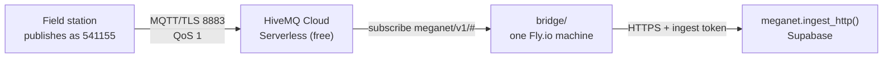

# Standing MQTT up: the broker, the bridge, and the first reading

[`ingest-mqtt.md`](ingest-mqtt.md) is the design — the topic scheme, the payload,
why QoS 1. [`bridge/README.md`](../bridge/README.md) is the subscriber's own
manual. **This page is the provisioning run**: the clicks, in order, from nothing
to a reading in the database, with a check after each part so you find out where
it went wrong at the step that broke rather than at the end.

Budget about an hour. Nothing here is irreversible, and nothing here costs money
at the sizes MegaNet is at.

---

## What you are building



Two things get provisioned, because Postgres cannot subscribe to MQTT and
Supabase does not host a broker:

| | What | Where | Cost |
|---|---|---|---|
| **Broker** | HiveMQ Cloud Serverless | hivemq.com, managed | Free to 100 connections |
| **Bridge** | `bridge/`, one container | Fly.io, one machine | Free to ~$2/mo |

The broker is a product you sign up for. The bridge is this repository's own
code, deployed. They are independent — a broker with no bridge is a broker
quietly holding messages, which is a fine state to be in for an hour.

**Before you start you need:** the `MEGANET_DB_URL` psql connection string (or
the Supabase SQL editor), a terminal with `git` and Node 20+, and an email
address. No credit card for the broker; Fly.io asks for one.

---

## Part 1 — The broker

### 1.1 Create the cluster

1. Go to **<https://console.hivemq.cloud/>** and sign up. Email + password, or
   GitHub/Google. Confirm the email.
2. On first sign-in it offers to create a cluster. Choose **Serverless** — the
   free plan. If it does not offer, click **Create New Cluster** → **Serverless**.
3. Pick the region **closest to where the bridge will run**, not to the stations.
   The stations' hop to the broker is one TLS connection they hold open; the
   bridge's hop is every message. Choose **AWS ap-southeast-2 (Sydney)** if
   offered — Supabase's MegaNet project is already in `ap-southeast-2`.
4. **Create**. It is ready in under a minute.

You land on the cluster's **Overview**. Copy two things into a scratch file:

```
Cluster URL   <something>.s1.eu.hivemq.cloud     ← yours will differ
Port          8883
```

That hostname plus port is `MQTT_URL=mqtts://<hostname>:8883` later. Note it is
`mqtts://`, not `mqtt://` — the bridge refuses a plaintext URL unless
`MQTT_ALLOW_INSECURE=1` is set, and the reason is that a plain connection sends
the broker password in clear text across the internet.

### 1.2 Two credentials, not one

Open **Access Management** (called *Credentials* in some versions of the
console). Create **two**, and give them different passwords:

| Username | Password | Permission |
|---|---|---|
| `meganet-bridge` | generate a long one | **Subscribe** to `meganet/v1/#` |
| `station-541155` | generate a long one | **Publish** to `meganet/v1/541155/#` |

Use a real bureau station number for the second one — whichever station you are
going to test with. `541155` is Loudoun Br AL and is used as the example
throughout this repo.

**Why the bridge may not publish.** A bridge that can publish is a bridge that
can fabricate a reading, and it has no reason to. Subscribe only.

**Why the station may not subscribe.** A logger has nothing to read here. If a
later ticket adds commands to stations — re-send yesterday, change a
configuration — that is a second topic branch and a second explicit permission,
not a widening of this one.

If the console's permission editor only offers a topic filter and a
Publish/Subscribe/Both radio, that is the same thing: filter `meganet/v1/#` +
Subscribe for the bridge, filter `meganet/v1/541155/#` + Publish for the station.

> **The ACL is generated, not hand-written.** Two credentials are fine to click.
> Three thousand are not, and hand-maintained ACLs drift from the registry. Once
> this works, generate them from the database — the exact query is in
> [`bridge/deploy/mosquitto.acl.example`](../bridge/deploy/mosquitto.acl.example),
> and it emits the bureau number, falling back to the station id for the sites
> that have none. Generating from the same column the database resolves against
> is what makes a mistyped number *loud*: the broker refuses a publish to a topic
> the credential does not own, instead of MegaNet quietly filing a reading under
> an identity nobody claims.

### 1.3 Check: the broker is real

From the repo, with the **station's** credentials — publishing successfully with
them is the proof the permission is right, and it costs nothing to find out now:

```sh
cd bridge && npm install
MQTT_URL=mqtts://<your-cluster>:8883 \
MQTT_USERNAME=station-541155 MQTT_PASSWORD='<the station password>' \
  npm run publish-sample -- --station 541155 --alert-id 6128 --value 42
```

Expect it to connect and publish. Nothing is listening yet, so nothing lands in
MegaNet — that is correct at this step.

If it hangs or is refused, the cause is one of three things, in this order:
wrong hostname, wrong password, or a permission whose topic filter does not
cover `meganet/v1/541155/#`.

---

## Part 2 — The ingest token

The bridge authenticates to MegaNet the same way a base-station logger does: an
ordinary ingest token, no service key. Three RPCs, and `revoked_at` turns all
three off at once. **The bridge is not more trusted than the loggers it relays
for.**

Against the database (psql, or the Supabase SQL editor):

```sql
select meganet.create_ingest_token('mqtt bridge');
```

**The token is shown once.** It starts `mgn_`. Copy it into your scratch file
now; only its hash is stored, so a lost token is re-minted, never recovered.

If you ever need to pull it: you cannot. Revoke and re-mint:

```sql
update meganet.ingest_token set revoked_at = now() where label = 'mqtt bridge';
select meganet.create_ingest_token('mqtt bridge');
```

---

## Part 3 — The bridge on Fly.io

### 3.1 Install and sign in

```sh
curl -L https://fly.io/install.sh | sh     # or: brew install flyctl
fly auth signup                            # or: fly auth login
```

Fly asks for a card. One shared-CPU machine with 256 MB sits inside the free
allowance; the bridge is one Node process with one dependency.

### 3.2 Create the app without deploying it

**From the repository root** — not from `bridge/`. The Dockerfile's build context
must be the repo root, because `src/messages.js` requires `hfem.js` from there
(one HFEM decoder for both the browser and the bridge). A context of `bridge/`
fails at the `COPY hfem.js` line, which is the loud version of that mistake.

```sh
fly launch --no-deploy --dockerfile bridge/Dockerfile
```

Answer its prompts:

- **App name** — `meganet-bridge`, or accept the generated one.
- **Region** — Sydney (`syd`). Same reasoning as the broker's region.
- **Postgres / Redis / Tigris** — **No** to all three. The bridge is stateless;
  its state is the broker's session and MegaNet's database.
- **Deploy now?** — **No**. Secrets first.

Then open the generated `fly.toml` and **delete the entire `[http_service]` (or
`[[services]]`) block**. The bridge listens for nothing — it makes two outbound
connections and serves no traffic. A public address on it is attack surface with
no purpose.

```toml
app = "meganet-bridge"
primary_region = "syd"

[build]
  dockerfile = "bridge/Dockerfile"

# No [http_service]: the bridge serves nothing. It dials the broker and the
# database, and both connections are outbound.

[[vm]]
  size = "shared-cpu-1x"
  memory = "256mb"
```

`fly.toml` is safe to commit — it holds no secrets.

### 3.3 Set the secrets

```sh
fly secrets set \
  MQTT_URL='mqtts://<your-cluster>:8883' \
  MQTT_USERNAME='meganet-bridge' \
  MQTT_PASSWORD='<the bridge password>' \
  MQTT_CLIENT_ID='meganet-bridge-prod' \
  MEGANET_API_URL='https://jjprlritvhdqpvphfrnu.supabase.co/rest/v1' \
  MEGANET_API_KEY='sb_publishable_PV9VjCM8NQeGAJMuwa5TKA_yX9GWacY' \
  MEGANET_INGEST_TOKEN='mgn_<the token from Part 2>'
```

Two of those are secret — `MQTT_PASSWORD` and `MEGANET_INGEST_TOKEN`. The API URL
and publishable key are the same pair `core.js` carries in the browser and are
not.

> **`MQTT_CLIENT_ID` is not optional here, and it is the whole reason "no acked
> message is lost" is true.** The bridge connects with `clean: false`, so the
> broker holds its queue while it is away. The queue is keyed by client id. A
> Fly machine gets a new hostname on every deploy, so without this set, the
> default `meganet-bridge-<hostname>` changes on each deploy and **every deploy
> orphans the previous session's queued messages**. Set it once, never change it.

### 3.4 Deploy

```sh
fly deploy --dockerfile bridge/Dockerfile
fly logs
```

A healthy start looks like a connect, then a subscribe at QoS 1:

```
info  connected to broker           clientId=meganet-bridge-prod
info  subscribed                    topic=meganet/v1/+/+/reading qos=1
info  subscribed                    topic=meganet/v1/+/+/reading/hfem qos=1
info  subscribed                    topic=meganet/v1/+/status qos=1
```

**Read the granted QoS, do not assume it.** If you see `subscribe_downgraded`
logged at error, the broker granted QoS 0 where the bridge asked for 1, and
at-least-once delivery is not in force — messages can be dropped silently in a
reconnect. That is a broker configuration problem, not a bridge one.

---

## Part 4 — Prove it end to end

Publish as the station again, now that something is listening:

```sh
cd bridge
MQTT_URL=mqtts://<your-cluster>:8883 \
MQTT_USERNAME=station-541155 MQTT_PASSWORD='<the station password>' \
  npm run publish-sample -- --station 541155 --alert-id 6128 --value 42
```

Within seconds:

```sql
select addr, reading_ts, value_raw, source
  from meganet.reading order by received_at desc limit 5;

select station_key, station_id, online, since, last_reading_at
  from meganet.station_health where station_id = 'loudoun_br_al';
```

**The station published under `541155`; the health row comes back keyed
`loudoun_br_al`.** That is correct and is the point of the identity work in
`0020`: the bureau number is how a station announces itself on the wire, and
`station.id` is how MegaNet files it once the identity resolves. A row still
keyed by a bare number is one the registry cannot name — check that number
against `meganet.station.station_number`.

And the bridge's own pulse, which is how you tell "no readings since Tuesday"
apart from "the relay died on Tuesday":

```sql
select bridge_id, connected, last_message_at, readings_accepted, errors_total
  from meganet.bridge_health;
```

### The Last Will

Kill the sample publisher with **`SIGKILL`, not Ctrl-C** — a clean disconnect
tells the broker not to send the will, which is exactly right and exactly not
what you are testing:

```sh
kill -9 %1        # or: pkill -9 -f publish-sample
```

The station should show `online = false` within seconds. **This is the single
thing most worth testing before a station goes in the field**, because it is the
whole reason MQTT earns its place here: offline detection with no polling and one
field in the logger's CONNECT packet.

---

## Part 5 — The one thing the free tier might not give you

The bridge's "no acked message is lost" guarantee rests on **persistent
sessions**: `clean: false`, a stable client id, and a broker that holds QoS 1
messages for a subscriber that is away. `bridge/test/integration.test.js` proves
the bridge's half against a real broker — mutating `clean: false` to `true` makes
that test time out waiting for readings the broker threw away.

HiveMQ Cloud Serverless publishes its limits as 100 connections, 10 GB of traffic
a month, 5 MB messages and up to three days of retention. **What it grants for
session expiry on the free plan is not something this page can promise** — verify
it, once, in about two minutes:

1. `fly machine stop` the bridge (or `fly scale count 0`).
2. Publish a reading as the station, exactly as in Part 4. It is now queued at
   the broker with nowhere to go.
3. `fly machine start` (or `fly scale count 1`).
4. Query `meganet.reading` for that reading.

**If it arrives, persistent sessions work and you are done.** If it does not, the
broker dropped the session while the bridge was away, and you have a real choice
to make: accept that a bridge restart loses in-flight readings, or move the
broker to EMQX Serverless or a Mosquitto VPS where
`persistent_client_expiration` is yours to set
([`bridge/deploy/mosquitto.conf.example`](../bridge/deploy/mosquitto.conf.example)).
Better to learn that now than after forty stations are flashed.

---

## When to move off the free tier

| Signal | What to do |
|---|---|
| Approaching 100 connections | One connection per publishing station, plus the bridge. HiveMQ Cloud Starter is unlimited connections, hourly billing. |
| Above 10 GB/month | At 15-minute reporting, MegaNet's whole network is nowhere near this. Recheck if reporting intervals shorten. |
| Persistent sessions insufficient (Part 5) | EMQX Serverless, or Mosquitto on a ~$5/mo VPS with the config in `bridge/deploy/`. |
| An employer broker appears | Ask for a credential on it. That is the best answer if the corporate move happens. |

Also worth knowing before real traffic: **`meganet.retain()` is still run by
hand.** The whole network at 15-minute reporting is roughly 914,000 rows a day,
which fills the Supabase free tier in under a week. That is a scheduling job that
does not exist yet, not a thing MQTT does to you — but MQTT is what makes it
arrive.

---

## When it does not work

| Symptom | Cause, in the order worth checking |
|---|---|
| Publisher hangs or is refused | Hostname; password; the credential's topic filter does not cover `meganet/v1/<number>/#`. |
| Bridge logs `subscribe_downgraded` | The broker granted QoS 0. At-least-once is not in force — fix at the broker. |
| Bridge connects, no readings | The station is publishing to a topic the bridge does not subscribe to. Check the segment count: `meganet/v1/<station>/<device>/reading` is five, and the device segment is not optional. |
| Readings land, `station_health` row keyed by a bare number | That number resolves to no station. Compare against `meganet.station.station_number` — most likely a leading zero (`041564` vs `41564`). |
| `PT401` from any RPC | The ingest token is wrong or revoked. Re-mint (Part 2). |
| PostgREST 404 | The function is not in the schema cache — usually a migration that has not been applied. Check `select value from meganet.app_meta where key = 'schema_version'`. |
| Every deploy loses queued messages | `MQTT_CLIENT_ID` is unset, so the client id moves with the hostname. §3.3. |

---

## What is still a person's job after this

Provisioning the broker and the bridge does not put a station on the air. A field
station still has to be told to publish — which is firmware, a credential, and a
site visit. The base-station logger in [`logger/`](../logger/README.md) speaks
HTTP today and does not speak MQTT at all; a base station relaying HFEM should
publish to this bridge instead. That work is separate and starts with commissioning
one site.
