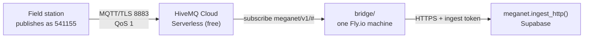

# Standing MQTT up, from a browser

[`ingest-mqtt.md`](ingest-mqtt.md) is the design — the topic scheme, the payload,
why QoS 1. [`bridge/README.md`](../bridge/README.md) is the subscriber's own
manual. **This page is the provisioning run**: the clicks, in order, from nothing
to a reading in the database, with a check after each part so you find out where
it went wrong at the step that broke rather than at the end.

**Everything here happens in a web browser.** No terminal, no `npm install`, no
`flyctl`. That is a hard constraint of how this project is operated, and it is
the reason the bridge deploys from a GitHub Actions button rather than a command
line — see [`.github/workflows/deploy-bridge.yml`](../.github/workflows/deploy-bridge.yml).

Budget about an hour. Nothing here is irreversible.

---

## What you are building



Two things get provisioned, because Postgres cannot subscribe to MQTT and
Supabase does not host a broker:

| | What | Where | Cost | Operated from |
|---|---|---|---|---|
| **Broker** | HiveMQ Cloud Serverless | hivemq.com | Free to 100 connections | its own console |
| **Bridge** | `bridge/`, one container | Fly.io | Free to ~$2/mo | **GitHub Actions** |

**Before you start you need:** a browser, a GitHub account with write access to
this repository, the Supabase SQL editor, and an email address. Fly.io asks for a
card.

### The four browser tabs you will use

| Tab | For |
|---|---|
| `console.hivemq.cloud` | the broker, its credentials, and its built-in MQTT Web Client |
| Supabase → SQL editor | minting the ingest token, and every query below |
| `github.com/cdomotor-g/MegaNet` → Settings, then Actions | the secrets, and the deploy button |
| `fly.io/dashboard` | watching the bridge's logs, stopping and starting it |

---

## Part 0 — Clean up the accidental Fly app

**Do this first, and do not skip it.** A `fly launch` run from the repository
root builds and deploys *the repository*, not the bridge — the whole MegaNet
tree, with whatever start command Fly guessed. That app is not the bridge, it
cannot become the bridge, and while it exists it may be running a machine you are
paying for.

1. Go to **<https://fly.io/dashboard>** and sign in.
2. You will see the app that got created — probably named `meganet` or something
   generated from the directory name. **It is not `meganet-bridge`.** Click it.
3. Open its **Settings** (left sidebar).
4. Scroll to the bottom, to the destructive section, and **delete the app**.
   Fly asks you to type the app name to confirm.
5. Back on the dashboard, confirm the list is now empty, or contains only apps
   you meant to create.

> **Nothing was lost.** No secrets were on that app, no data was in it, and
> deleting it does not touch your Fly account, your card, or anything in this
> repository. The only trace it leaves is a line in your Fly billing history.

**This is why the rest of this page does not use `fly launch`.** That command
reads the directory it is standing in and makes decisions on your behalf, which
is fine when you know exactly what it will find and a trap when you do not. The
workflow in Part 3 names the Dockerfile, the config and the build context
explicitly, every time, and it cannot pick up anything else.

---

## Part 1 — The broker

*You have already done this part. It is here so the page is complete, and so
§1.4 gives you a way to check it that needs no terminal.*

### 1.1 Create the cluster

1. Go to **<https://console.hivemq.cloud/>** and sign up. Email and password, or
   GitHub/Google. Confirm the email.
2. On first sign-in it offers to create a cluster. Choose **Serverless** — the
   free plan.
3. Pick the region **closest to where the bridge will run**, not to the stations.
   A station's hop is one TLS connection it holds open; the bridge's hop is every
   message. Take **AWS ap-southeast-2 (Sydney)** if offered — the MegaNet
   Supabase project is already in `ap-southeast-2`.
4. **Create.** Ready in under a minute.

From the cluster's **Overview**, copy the hostname. You need it twice: once as a
GitHub variable in Part 3, and once in the Web Client below.

```
Cluster URL   <something>.s1.eu.hivemq.cloud     ← yours will differ
Port          8883      MQTT over TLS   — what the bridge and loggers use
Port          8884      MQTT over WSS   — what the Web Client uses
```

### 1.2 Two credentials, not one

Open **Access Management**. Create **two**, with different passwords:

| Username | Password | Permission | Topic filter |
|---|---|---|---|
| `meganet-bridge` | generate a long one | **Subscribe** | `meganet/v1/#` |
| `station-541155` | generate a long one | **Publish** | `meganet/v1/541155/#` |

Use a real bureau station number for the second one. `541155` is Loudoun Br AL
and is the example used throughout this repository.

**Why the bridge may not publish.** A bridge that can publish is a bridge that
can fabricate a reading, and it has no reason to. Subscribe only.

**Why the station may not subscribe.** A logger has nothing to read here. If a
later ticket adds commands to stations — re-send yesterday, change a
configuration — that is a second topic branch and a second explicit permission,
not a widening of this one.

**Write both passwords down now.** HiveMQ shows a generated password once.

### 1.3 One credential per station, generated

Two credentials are fine to click. Three thousand are not, and hand-maintained
ACLs drift from the registry. Once this works, generate them from the database —
the query is in
[`bridge/deploy/mosquitto.acl.example`](../bridge/deploy/mosquitto.acl.example),
and it emits the bureau number, falling back to the station id for the sites that
have none.

Generating from the same column the database resolves against is what makes a
mistyped number **loud**: a credential may only write the topic its own number
spells, so a logger flashed with `041564` instead of `41564` is refused by the
broker rather than filed under an identity nobody claims.

### 1.4 Check — the broker works, from the browser

HiveMQ Cloud has an MQTT client built into the console. **Web Client** tab, on
your cluster.

1. Open the **Web Client** tab.
2. In **Connection Settings**, enter the **station** credential —
   `station-541155` and its password. (The tab can also generate a throwaway
   credential for you; use your real one, because testing the credential is the
   point.)
3. **Connect Client.** It connects over WebSocket on 8884.
4. In the publish box:

   | Field | Value |
   |---|---|
   | Topic | `meganet/v1/541155/logger/reading` |
   | QoS | `1` |
   | Retain | off |
   | Message | `{"alert_id": 6128, "reading_ts": "2026-08-19T04:15:00Z", "value_raw": 301}` |

5. **Publish.**

**Expected:** it publishes without error. Nothing lands in MegaNet yet — nothing
is subscribed. That is correct at this step.

Now prove the ACL is doing its job, which is the half nobody tests:

6. Change the topic to `meganet/v1/999999/logger/reading` and publish again.
   **This should fail or be silently dropped by the broker**, because the
   credential may only write `meganet/v1/541155/#`. If it *succeeds*, the
   credential's permission is too wide — go back to §1.2 and narrow it.

> If it hangs or is refused on step 5, the cause is one of three things in this
> order: wrong hostname, wrong password, or a topic filter that does not cover
> `meganet/v1/541155/#`.

---

## Part 2 — The ingest token

The bridge authenticates to MegaNet the same way a base-station logger does: an
ordinary ingest token, no service key. Three RPCs, and `revoked_at` turns all
three off at once. **The bridge is not more trusted than the loggers it relays
for.**

In the **Supabase SQL editor**:

```sql
select meganet.create_ingest_token('mqtt bridge');
```

**The token is shown once.** It starts `mgn_`. Copy it somewhere you can paste
from in Part 3 — only its hash is stored, so a lost token is re-minted, never
recovered.

If you lose it, you cannot retrieve it. Revoke and re-mint:

```sql
update meganet.ingest_token set revoked_at = now() where label = 'mqtt bridge';
select meganet.create_ingest_token('mqtt bridge');
```

---

## Part 3 — The bridge, from a GitHub button

This is the part that used to say "install flyctl". It does not any more. The
deploy is
[`.github/workflows/deploy-bridge.yml`](../.github/workflows/deploy-bridge.yml),
and it names the Dockerfile, the config and the build context explicitly, so it
cannot deploy the wrong thing the way Part 0's app happened.

### 3.1 Get a Fly token

1. Go to **<https://fly.io/dashboard>**, signed in.
2. Click **your account** (top-right avatar) → **Personal Access Tokens** in the
   sidebar. The direct link is usually
   <https://fly.io/user/personal_access_tokens>.
3. **Create token.** Name it `meganet-bridge deploy`. Take the default expiry.
4. **Copy it immediately** — it is shown once, and it starts `Fly`.

> This token can create and manage apps in your Fly account, which is what lets
> the workflow create `meganet-bridge` on its first run without you touching a
> terminal. If you would rather it could only touch one app, create the app in
> the Fly dashboard first and then use that app's **Tokens** tab for a
> deploy-scoped token instead.

### 3.2 Put the five values into GitHub

Go to the repository → **Settings** → **Secrets and variables** → **Actions**.
There are two tabs on that page and you need both.

**Secrets tab** → *New repository secret*, three times:

| Name | Value |
|---|---|
| `FLY_API_TOKEN` | the token from §3.1 |
| `MQTT_PASSWORD` | the **`meganet-bridge`** credential's password (not the station's) |
| `MEGANET_INGEST_TOKEN` | the `mgn_…` token from Part 2 |

**Variables tab** → *New repository variable*, twice:

| Name | Value |
|---|---|
| `MQTT_URL` | `mqtts://<your-cluster>.hivemq.cloud:8883` |
| `MQTT_USERNAME` | `meganet-bridge` |

> **Why two of them are variables rather than secrets.** Neither is sensitive,
> and a hostname you cannot read back is a hostname you cannot check when the
> bridge will not connect. Secrets are write-only in the GitHub UI — you would be
> debugging a typo you are not allowed to look at.
>
> `MEGANET_API_URL` and `MEGANET_API_KEY` are not on this list at all. They are
> the publishable pair `core.js` already ships to every browser, so the workflow
> carries them as literals.

### 3.3 Press the button

1. Repository → **Actions** tab.
2. **Deploy the MQTT bridge**, in the left sidebar.
3. **Run workflow** (right-hand side) → leave `meganet-bridge` and `syd` as they
   are → **Run workflow**.
4. Click into the run and watch it.

The first step checks all five values are present and **names every one that is
missing at once**, rather than failing on the first. If it stops there, fix what
it names and press the button again — nothing was created.

**On the first run it creates the Fly app.** On every run after that it finds the
existing app and leaves it alone.

### 3.4 Check — the bridge is connected

The workflow's summary page prints `fly status` when it finishes. For the log
lines that actually matter:

1. **<https://fly.io/dashboard>** → **meganet-bridge** → **Live Logs**.
2. A healthy start is a connect, then three subscribes at QoS 1:

```
info  connected to broker    clientId=meganet-bridge-prod
info  subscribed             topic=meganet/v1/+/+/reading qos=1
info  subscribed             topic=meganet/v1/+/+/reading/hfem qos=1
info  subscribed             topic=meganet/v1/+/status qos=1
```

**Read the granted QoS, do not assume it.** If you see `subscribe_downgraded`
logged at error, the broker granted QoS 0 where the bridge asked for 1, and
at-least-once delivery is not in force — messages can be dropped silently in a
reconnect. That is a broker configuration problem, not a bridge one.

---

## Part 4 — Prove it end to end

Back to the **HiveMQ Web Client** (§1.4), connected as `station-541155`.

### A reading

Publish, exactly as in §1.4 — but **change the timestamp** from the one you used
there:

| Field | Value |
|---|---|
| Topic | `meganet/v1/541155/logger/reading` |
| QoS | `1` |
| Retain | off |
| Message | `{"alert_id": 6128, "reading_ts": "2026-08-19T05:30:00Z", "value_raw": 301}` |

Then, in the **Supabase SQL editor**, within seconds:

```sql
select addr, reading_ts, value_raw, source, dup_count
  from meganet.reading order by received_at desc limit 5;
```

> **Republish the identical message and the row does not duplicate — `dup_count`
> increments instead.** That is `meganet.reading`'s primary key (address,
> instant, value) doing the job that makes QoS 1 safe to use: at-least-once
> delivery guarantees duplicates, and the key eats them and counts them. Worth
> doing once, because it is the reason the whole design does not need QoS 2.

### The station's health row

```sql
select station_key, station_id, online, since, last_reading_at
  from meganet.station_health where station_id = 'loudoun_br_al';
```

**The station published under `541155`; the row comes back keyed
`loudoun_br_al`.** That is correct, and it is the point of the identity work in
`0020`: the bureau number is how a station announces itself on the wire, and
`station.id` is how MegaNet files it once the identity resolves. A row still
keyed by a bare number is one the registry cannot name — check that number
against `meganet.station.station_number`.

### The bridge's own pulse

How you tell "no readings since Tuesday" apart from "the relay died on Tuesday":

```sql
select bridge_id, connected, last_message_at, readings_accepted, errors_total
  from meganet.bridge_health;
```

### The Last Will — and how to fire one without a terminal

This is the single thing most worth testing before a station goes in the field,
because it is the whole reason MQTT earns its place here: offline detection with
no polling and one field in the logger's CONNECT packet.

The Web Client needs to connect **with a will set**, which the HiveMQ console's
client may not expose. If it has no Last-Will fields, use
**<https://web.mqttx.app/>** instead — same thing, in a browser, and its
connection dialog has them.

1. Connect as `station-541155` to `wss://<your-cluster>.hivemq.cloud:8884`, with:

   | Last Will field | Value |
   |---|---|
   | Will topic | `meganet/v1/541155/status` |
   | Will QoS | `1` |
   | Will retain | **on** |
   | Will payload | `{"online": false}` |

2. Once connected, publish the *live* status — topic
   `meganet/v1/541155/status`, QoS 1, **retain on**, payload
   `{"online": true, "battery_v": 12.9}`.
3. Check it landed:

   ```sql
   select station_key, online, since from meganet.station_health
    where station_id = 'loudoun_br_al';
   ```

4. **Now close the browser tab.** Do not click Disconnect.

> **Closing the tab is the browser's `kill -9`.** A clean disconnect tells the
> broker *not* to send the will, which is exactly right and exactly not what you
> are testing. Killing the tab drops the WebSocket without a DISCONNECT packet,
> the broker calls it an ungraceful disconnect, and the will fires — the same
> path a station losing power takes.

5. Re-run the query. `online` should be `false` within seconds, and `since`
   should be the moment the tab closed.

---

## Part 5 — The one thing to verify

The bridge's "no acked message is lost" guarantee rests on **persistent
sessions**: `clean: false`, a stable client id, and a broker that holds QoS 1
messages for a subscriber that is away. `bridge/test/integration.test.js` proves
the bridge's half against a real broker on every CI run — mutating
`clean: false` to `true` makes that test time out waiting for readings the broker
threw away.

HiveMQ Cloud Serverless publishes its limits as 100 connections, 10 GB of traffic
a month, 5 MB messages and up to three days of retention. **What it grants for
session expiry on the free plan is not something this page can promise** — verify
it, once, in about two minutes, all from the browser:

1. **Fly dashboard** → `meganet-bridge` → **Machines** → stop the machine.
2. **HiveMQ Web Client** → publish a reading as in Part 4, with a new timestamp.
   It is now queued at the broker with nowhere to go.
3. **Fly dashboard** → start the machine again.
4. **Supabase SQL editor** → query `meganet.reading` for that reading.

**If it arrives, persistent sessions work and you are done.** If it does not, the
broker dropped the session while the bridge was away, and you have a real choice
to make: accept that a bridge restart loses in-flight readings, or move the
broker to EMQX Serverless or a Mosquitto VPS where
`persistent_client_expiration` is yours to set
([`bridge/deploy/mosquitto.conf.example`](../bridge/deploy/mosquitto.conf.example)).
Better to learn that now than after forty stations are flashed.

> **This is also why `MQTT_CLIENT_ID` is pinned in
> [`bridge/fly.toml`](../bridge/fly.toml) rather than left to default.** The
> broker's queue is keyed by client id, and a Fly machine gets a new hostname on
> every deploy. Left to default, every deploy would orphan the previous session's
> queued messages — the exact guarantee this part exists to protect. Do not
> change that string.

---

## When to move off the free tier

| Signal | What to do |
|---|---|
| Approaching 100 connections | One connection per publishing station, plus the bridge. HiveMQ Cloud Starter is unlimited connections, hourly billing. |
| Above 10 GB/month | At 15-minute reporting, MegaNet's whole network is nowhere near this. Recheck if reporting intervals shorten. |
| Persistent sessions insufficient (Part 5) | EMQX Serverless, or Mosquitto on a ~$5/mo VPS with the config in `bridge/deploy/`. |
| An employer broker appears | Ask for a credential on it. That is the best answer if the corporate move happens. |

Also worth knowing before real traffic: **`meganet.retain()` is still run by
hand.** The whole network at 15-minute reporting is roughly 914,000 rows a day,
which fills the Supabase free tier in under a week. That is a scheduling job that
does not exist yet, not a thing MQTT does to you — but MQTT is what makes it
arrive.

---

## When it does not work

| Symptom | Cause, in the order worth checking |
|---|---|
| Workflow fails on its first step | One of the five values is unset. It names every missing one at once — set them and press the button again. Nothing was created. |
| Workflow fails at `apps create` | The Fly token is wrong, expired, or scoped to a single app that does not exist yet. Re-read §3.1. |
| Web Client will not connect | Use port **8884** and `wss://`, not 8883 — 8883 is the TLS port for native MQTT clients and a browser cannot speak it. |
| Publish refused | The credential's topic filter does not cover the topic. A station credential may only write `meganet/v1/<its own number>/#`. |
| Bridge logs `subscribe_downgraded` | The broker granted QoS 0. At-least-once is not in force — fix at the broker. |
| Bridge connects, no readings | The station is publishing to a topic the bridge does not subscribe to. Count the segments: `meganet/v1/<station>/<device>/reading` is five, and the device segment is not optional. |
| Reading lands, but `dup_count` rises and no new row | Working as designed — you republished an identical (address, instant, value). Change the timestamp. |
| `station_health` row keyed by a bare number | That number resolves to no station. Compare against `meganet.station.station_number` — most likely a leading zero (`041564` vs `41564`). |
| `PT401` from any RPC | The ingest token is wrong or revoked. Re-mint (Part 2). |
| PostgREST 404 | The function is not in the schema cache — usually a migration that has not been applied. Check `select value from meganet.app_meta where key = 'schema_version'`. |
| Every deploy loses queued messages | `MQTT_CLIENT_ID` has been changed or unset. It is pinned in `bridge/fly.toml` — put it back. |

---

## What is still a person's job after this

Provisioning the broker and the bridge does not put a station on the air. A field
station still has to be told to publish — which is firmware, a credential, and a
site visit. The base-station logger in [`logger/`](../logger/README.md) speaks
HTTP today and does not speak MQTT at all; a base station relaying HFEM should
publish to this bridge instead. That work is separate and starts with
commissioning one site.

[`elpro115e_mqtt.md`](elpro115e_mqtt.md) is that work for one device — an ELPRO
115E-2 gateway — split into the sysadmin's half and the technician's half, with
the credentials sheet that passes between them. With Sparkplug turned off the
device publishes JSON under a free-form topic prefix, so it can be pointed at
this scheme exactly; what it cannot do is name the payload's keys, which is one
parser in `bridge/` and the page says which.
